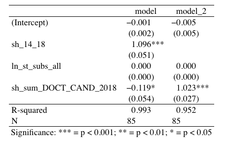

# Модели
```{r warning=FALSE, include=FALSE, message=FALSE}
library("memisc")  # две и более регрессий в одной табличке
library("psych")  # описательные статистики
library("lmtest")  # тестирование гипотез в линейных моделях
library("car")
library("hexbin")  # графики
library(readr)
library(reshape2)
library(dplyr)
library(knitr)
library(kableExtra)

```


```{r warning=FALSE, include=FALSE, message=FALSE}
h <- read_csv("data/full_table_7_04.csv") 
glimpse(h)  # бросим взгляд на данные
colnames(h)
```

```{r warning=FALSE, include=FALSE, message=FALSE}
h_cut <- h %>% dplyr::select(2,3,8:11,62:69,76:93,35:40)
glimpse(h_cut)
```

```{r eval=FALSE, echo=FALSE}
# построим функцию плотности
h_long <- h %>% dplyr::select(-1,-(14:93)) %>% melt() 

ggplot(data = h_long, aes(x = value)) + 
  stat_density() + 
  facet_wrap(~variable, scales = "free")

qplot(x, y, geom = "line")
# диаграмма рассеяния
h1 <- h %>% filter(region_rus_from_map != "г. Москва", region_rus_from_map != "г. Санкт-Петербург") 
qplot(h1$UNI_COUNT_2014, h1$rnf2014)
# гистограмма
qplot(data = h, ves)
```

```{r warning=FALSE, include=FALSE, message=FALSE }
sum_DOCT_CAND_2018 <- sum(h_cut$DOCT_CAND_2018,na.rm = TRUE)
h_cut <- h_cut %>% mutate(sh_14_18 = (sh_2014 + sh_2015 + sh_2016 + sh_2017 + sh_2018)/5,
                          st_subs_all = state_subsidy2018+state_subsidy2018_2+grant_fonds+other_types_financing,
                          ln_st_subs_all = log(state_subsidy2018+state_subsidy2018_2+grant_fonds+other_types_financing+1),
                          sh_sum_DOCT_CAND_2018 = DOCT_CAND_2018/sum_DOCT_CAND_2018)
h_cut[is.na(h_cut)] <- 0
```

_ПОМНИ о Чукотке и Еврейская АОб там не 0, там нет данных (примечание в росстате: засекречены WTF). Пока сделаем нули вместо NA_

Будем отталкиваться от модели вида:

$$sh\_grants_{2019} = sh\_grants_{2014-2018} +  \log(gov\_subs_{2018}) + sh\_doct_{2018}$$
где, 

$sh\_grants_{2019}$ - доля грантов у региона в 2019

$sh\_grants_{2014-2018}$ - доля грантов у региона в 2014-2018

$\log(gov\_subs_{2018})$ - логарифм суммы четырех видов субсидий из госбюджета в 2018 (см. Переменные и гипотезы Н1)

$sh\_doct_{2018}$ - доля докторов + кандидатов в регионе от общего числа по России в 2018


```{r warning=FALSE, include=FALSE, message=FALSE}
# оценим модель множественной регрессии
model <- lm(data = h_cut, sh_2019 ~ sh_14_18 + ln_st_subs_all + sh_sum_DOCT_CAND_2018)
# посмотрим результаты оценивания
summary(model)
model_2 <- lm(data = h_cut, sh_2019 ~ ln_st_subs_all + sh_sum_DOCT_CAND_2018)
summary(model_2)
# отдельно табличка с тестами
#coeftest(model)
#coeftest(model_2)
#confint(model)  # доверительные интервалы для коэффициентов
```

```{r eval=FALSE, echo=FALSE}
# ЭТО НЕ ТРОГАЛА, ВДРУГ ПОНАДОБИТСЯ

# проверка гипотезы b_Cath=b_Agri построение вспомогательной модели
model_aux <- lm(data = h, Fertility ~ Catholic + I(Catholic + Agriculture) + Examination)
summary(model_aux)

# проверка гипотезы без построения вспомогательной модели
linearHypothesis(model, "Catholic-Agriculture=0")
```

```{r eval=FALSE, echo=FALSE}

# стандартизированные коэффициенты

# масштабируем каждую переменную (вычитаем среднее, делим на стандартную ошибку)
h_st <- h_cut %>% select(sh_2019, sh_14_18, ln_st_subs_all, sh_sum_DOCT_CAND_2018)
h_st <- mutate_each(h_st, "scale")
glimpse(h_st)  # смотрим на новый набор данных
# оцениваем модель по стандартизированным данным
model_st <- lm(data = h_st, sh_2019 ~ sh_14_18 + ln_st_subs_all + sh_sum_DOCT_CAND_2018)
summary(model_st)  # отчет о новой модели
model_st_2 <- lm(data = h_st, sh_2019 ~  +ln_st_subs_all + sh_sum_DOCT_CAND_2018)
summary(model_st_2)
```

```{r warning=FALSE, message=FALSE, echo=FALSE}
# сравниваем несколько моделей
compar_12 <- mtable(model, model_2)
show_html(compar_12)
```


```{r eval=FALSE, echo=FALSE}
# сравниваем несколько моделей
compar_st_12 <- mtable(model_st, model_st_2)
compar_st_12
```

#### Диаграммы рассеяния {-}

_Доля грантов у региона в 2019_ и _доля грантов у региона в 2014-2018_ связаны линейно.
```{r warning=FALSE, message=FALSE, echo=FALSE}

qplot(h_cut$sh_2019, h_cut$sh_14_18)
```

Уберем ТОП-3 всё еще связаны линейно. 
```{r warning=FALSE, message=FALSE, echo=FALSE}
h_cut_non_cap <- h_cut %>% dplyr::filter(region_rus_from_map != "г. Москва", 
                                  region_rus_from_map != "г. Санкт-Петербург",
                                  region_rus_from_map != "Новосибирская область") 
qplot(h_cut_non_cap$sh_2019, h_cut_non_cap$sh_14_18)
```
Точно такие же графики по связи _доли грантов у региона в 2019_ и _доли докторов + кандидатов в регионе от общего числа по России в 2018_

```{r eval=FALSE, echo=FALSE}

qplot(h_cut$sh_2019, h_cut$sh_sum_DOCT_CAND_2018)
```
```{r eval=FALSE, echo=FALSE}
h_cut_non_cap <- h_cut %>% dplyr::filter(region_rus_from_map != "г. Москва",
                                  region_rus_from_map != "Московская область",
                                  region_rus_from_map != "г. Санкт-Петербург",
                                  region_rus_from_map != "Новосибирская область")
qplot(h_cut_non_cap$sh_2019, h_cut_non_cap$sh_sum_DOCT_CAND_2018)
```


```{r eval=FALSE, echo=FALSE}
# Диаграммы рассеяния для стандартизированной шкалы h_st
qplot(h_st$sh_2019, h_st$sh_14_18)
```
```{r eval=FALSE, echo=FALSE}
h_cut_non_cap <- h_cut %>% filter(region_rus_from_map != "г. Москва", 
                                  region_rus_from_map != "г. Санкт-Петербург",
                                  region_rus_from_map != "Новосибирская область") 
qplot(h_cut_non_cap$sh_2019, h_cut_non_cap$sh_14_18)
```
```{r eval=FALSE, echo=FALSE}

qplot(h_st$sh_2019, h_st$sh_sum_DOCT_CAND_2018)
```


```{r eval=FALSE, echo=FALSE}

# построим функцию плотности
h_long <- h %>% dplyr::select(-1,-(14:93)) %>% melt() 

ggplot(data = h_long, aes(x = value)) + 
  stat_density() + 
  facet_wrap(~variable, scales = "free")

qplot(x, y, geom = "line")
# гистограмма
qplot(data = h, ves)
```
