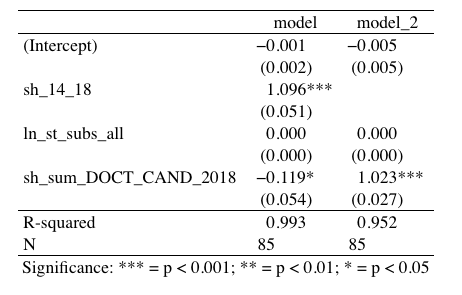

--- 
title: "Гранты РНФ"
author: ""
date: "версия от `r Sys.Date()`"
site: bookdown::bookdown_site
output: bookdown::gitbook
documentclass: book
bibliography: [book.bib, packages.bib]
biblio-style: apalike
link-citations: yes
github-repo: rstudio/bookdown-demo
description: ""
---

# Что мы делаем

Мы знаем как распределялись гранты РНФ по регионам в 2014-2019. Мы не знаем связаны ли характеристики регинов с таким распределением. Если характеристики регионов имеют значение, то какие именно? Если характреистики регирнов не важны, то тоже интересно.


<!--chapter:end:index.Rmd-->

# Переменные и гипотезы


### Что такое _y_ {-}

1. ~~Грантов по годам на 10 000 исследователей (2014, 2015...2019)~~
2. ~~Грантов за период на 10 000 исследователей (два периода: 2014-2016, 2017-2019)~~
3. <span style="background-color: #ffe6ff">Доля грантов по годам и по двум периодам</span>

_Примечание: оставляем 3. Нормируем не исследователями, а долей, чтобы не тратить потенциальный x_. СТОП ЭТО ТАК НЕ РАБОТАЕТ. ПОДУМАЙ

### Что может обяснять _y_ {-}

Пока всё в кучу, и основные гипотези и контрольные переменные.

*** 
**H1: Деньги к деньгам** -- если регион в период _t_ тратил деньги на науку, то в период _t+1_ у него будет больше грантов РНФ.

Возможные переменные:

1. Доля ВРП на R&D (период: 2013-2018) (источник: Росстат. Регоионы России) <span style="color: #ff66cc;">есть всё</span> ✅
2. Четрыре пепеменные по финансированию из фед бюджета (период: 2015-2019) (источник: форма наука-2) <span style="color: #ff66cc;">есть 2018</span>
    + на фундаментальный исследования
    + на прикладные исследования
    + другие гранты
    + другое финансирование

_Примечание: 2 в деньгах, в логарифмах?_

*** 
**H2: Человеческие ресурсы** -- если в регионе в период _t_ большое число публикаций, то в период _t+1_ у него будет больше грантов РНФ.

Возможные переменные:

1. Доля публикаций в Scopus (период: ?) (источник: Дашин датасет, надо города раскидать по регионам) <span style="color: #ff66cc;">уточнить</span> ❗️
2. Число докторов наук (период: 2013-2018) (источник: Росстат. Регоионы России) <span style="color: #ff66cc;">есть всё</span> ✅ 
3. Число кандидатов наук (период: 2013-2018) (источник: Росстат. Регоионы России) <span style="color: #ff66cc;">есть всё</span> ✅

_Примечание: 2 и 3 нормировать на население?_

*** 
**H3: Инфрастуктура** -- если в регионе есть "особый университет" (5:100), в нем будет больше грантов РНФ.

Возможные переменные:

1. Дамми на унивеситет из 5:100 ([список тут](https://www.5top100.ru/universities/)) <span style="color: #ff66cc;">есть всё</span> ✅

_Примечание: скорее всего скореллированно с предыдущими переменными_

*** 
**H4: Гранты к грантам** -- если регион в период _t_ получил много грантов, то в период _t+1_ у него тоже будет много грантов РНФ.

Возможные переменные:

1. Доля региона в пероиод 2014-2016 (когда _у_ это доля региона в пероиод 2017-2019) <span style="color: #ff66cc;">есть</span> 

_Примечание: это что такое вообще? просто автокорреляция же? играем во веменные ряды на двух периодах? номрально ли это?_

*** 
**H5: Пространственный эффект** -- регион _i_ граничит с регионом _j_. В период _t_ регион _i_ получил много грантов, тогда в период _t+1_ регионом _j_ тоже получит много грантов. <span style="color: #ff66cc;">опровергнуто катрой</span> 

_Примечание: Для начала посмотреть карту? + [Индекс Морана](https://tsamsonov.github.io/r-geo-course/autocorrelation.html)?_

*** 
**H6: Диверсификация имеет значение** -- контроль на кол-во исследовательских организаций + чем регион преимущественно занимается. 

Возможные переменные:

1. Придумать дайверсити индекс для региона на основе данных РИНЦ (период:?) (источник: Дашин датасет) <span style="color: #ff66cc;">уточнить</span> ❗️ 

*** 
**Заметки на полях**: Откуда эксперты, кто принимает решение? Есть ли регионе человек из экспертного совета?


<!--chapter:end:02-hypothesis.Rmd-->

# Описатеьные статистики
```{r setup, include=FALSE}
knitr::opts_chunk$set(echo = FALSE)
```
```{r warning=FALSE, include=FALSE, message=FALSE}
library(knitr)
library(kableExtra)
library(dplyr)
library(readr)
library(fBasics)
library(formattable)
library(plotrix)
library(stringr)
```

### О данных {-}
<span style="color: #d9d9d9">_В датасете исправлены ошибки и сделаны en_названия регионов. Те full_table_7_04.csv финальный датасет со всем-всем + доп колонки с росстата. NA заменены на нули. Мое + Алексей. Надо объединить кодбук. Все преобразования датасета в файле scr1.R_</span>

```{r warning=FALSE,  include=FALSE, message=FALSE}
df <- read_csv("~/Desktop/Applied_Geography/rnf_model/grantbook/data/full_table_7_04.csv")
#write.csv(alexey_database, "alexey_database.csv",row.names = TRUE, fileEncoding = "UTF-8" )
```

### Описательные статистики {-}
```{r warning=FALSE}
df_cut_stat <- df %>% 
  select(35:40)
df_cut_stat[df_cut_stat==0] <- NA
J <- basicStats(df_cut_stat)
J <- data.frame(t(J))
J <- formattable(J, digits = 2) %>% select(1:9)

knitr::kable(J, booktabs = T) %>%
  kable_styling(font_size = 12)
#write.csv(J, "descr_stat.csv",row.names = TRUE, fileEncoding = "UTF-8" )
```

Смотрим на NA: от 21 до 38 регионов не получают грантов РНФ вообще (за 2014-2019 гг). Медиана в разы меньше среднего + третий квантиль колеблется от 6 до 16 при максимуме от 134 до 827. Рапределие далеко от нормального и будет иметь очень длинный хвост. Очень неоднородное кол-во грантов по годам: в 2015 выдали 418 грантов, в 2019 -- 2096.

### Таблицы {-}

Уйдем от штук на доли, чтобы нивелировать сильный разброс в кол-ве выданных грантов по годам. 

Попробуем поймать таблицей какую-нибудь красивую тенденцию, например, поишем регионы, которые год от года увеличивают совою долю грантов.  

###### Дурацкая таблица: _доля грантов РНФ (от всех выданных грантов РНФ по стране в соответствующй год)_ {-}
```{r warning=FALSE, message=FALSE}
# возвращаемся к df_cut_share
df_color <- df %>% 
  mutate(change2015 = sh_2015-sh_2014,
         change2016 = sh_2016-sh_2015,
         change2017 = sh_2017-sh_2016,
         change2018 = sh_2018-sh_2017,
         change2019 = sh_2019-sh_2018) %>% 
  mutate_if(is.numeric, round, digits = 5)

#write.csv(df_color, "df_color.csv",row.names = TRUE, fileEncoding = "UTF-8" )
```

```{r warning=FALSE, message=FALSE}

g <- formattable(df_color, list(
  `sh_2015`= formatter("span", style = ~ style(color = ifelse(`sh_2015` >`sh_2014`, "green", "red")),
                    ~ icontext(ifelse(`sh_2015` >`sh_2014`,"arrow-up", "arrow-down"), `sh_2015`)),
  `sh_2016`= formatter("span", style = ~ style(color = ifelse(`sh_2016` >`sh_2015`, "green", "red")),
                       ~ icontext(ifelse(`sh_2016` >`sh_2015`,"arrow-up", "arrow-down"), `sh_2016`)),
  `sh_2017`= formatter("span", style = ~ style(color = ifelse(`sh_2017` >`sh_2016`, "green", "red")),
                       ~ icontext(ifelse(`sh_2017` >`sh_2016`,"arrow-up", "arrow-down"), `sh_2017`)),
  `sh_2018`= formatter("span", style = ~ style(color = ifelse(`sh_2018` >`sh_2017`, "green", "red")),
                       ~ icontext(ifelse(`sh_2018` >`sh_2017`,"arrow-up", "arrow-down"), `sh_2018`)),
  `sh_2019`= formatter("span", style = ~ style(color = ifelse(`sh_2019` >`sh_2018`, "green", "red")),
                       ~ icontext(ifelse(`sh_2019` >`sh_2018`,"arrow-up", "arrow-down"), `sh_2019`)))) %>%
  select(3, starts_with("sh_2")) 

as.datatable(g) # стрелочки пропали из за нее 
```


Столбец _sh_2014_ не окрашен, так как цвет говорит об изменении к предыдущему году. Никакой супер интересной тенденции в табличке не видно, на первый взгляд все регионы теряют доли и прирастают ими довольно хаотично. Ну кроме некоторых регионов, у которых стабильный 0. Их легко увидеть, если все столбики отсортировать по возрастанию имеющимися стрелочками.

***

$HHI=доля^2+S_{2}^{2}+...+S_{n}^{2}}$
###### Таблица получше: _доля грантов РНФ в 2014-2016 (first_period) и в 2017-2019 (second_period) (от всех выданных грантов РНФ по стране в соответствующй период)_ {-}
```{r warning=FALSE, message=FALSE}
#colnames(df_color)

f <- formattable(df_color, list(
  `second_period`= formatter("span", style = ~ style(color = ifelse(`second_period` >`first_period`, "green", "red")),
                    ~ icontext(ifelse(`second_period` >`first_period`,"arrow-up", "arrow-down"), `second_period`)))) %>%
  select(3, 68, 69) 
as.datatable(f)

```

Видим стабильные ~40 % у Москвы, 11-14 % у Петербурга и 9 % у Новосибирска. Не выходя из Топ-10 уже видим у Приморья и Ростовской области по 1%, на остальные 9 страничек даже и не перелисытвать не надо.

У _first_period_ и _second_period_ коэфицент корреляции что-то около 0,85-0,9, то есть, если регион получал гранты в 2014-2016 году, то он будет получать примерно на таком же уровне в 2017-2019. И наоборот, те у кого грантов не было с самого начала, то во втором периоде чуда не случится. (РАЗБЕРИСЬ С КОЭФИЦЕНТАМИ КОРРЕЛЯЦИИ, КАКОЙ ИЗ НИХ НУЖЕН ПРИ ТАКОМ РАСПРЕДЕЛЕНИИ)

### Боксплоты {-}

Хочется посмотреть выбросы, причем поймать как будут сжиматься медиана и максимальное значаение выданных грантов, когда мы будем эти выбросы постепенно убирать.

```{r warning=FALSE}
# long 85 * 6 = 510
library(tidyr)

data_long <- df %>% select(3, region_id,starts_with("rnf20"))
data_long <- gather(data_long, condition, measurement, rnf2014:rnf2019, factor_key=TRUE)
data_long <- data_long %>% mutate(condition = gsub("[^0-9.-]+", "", condition))
data_long <- data_long %>%
  mutate(measurement = if_else(is.na(measurement), 0, measurement))

data_long <- as.data.frame(data_long)

data_long_cut_11_12_38 <- data_long %>% 
  dplyr::filter(region_id != 11) %>% 
  dplyr::filter(region_id != 12) %>% 
  dplyr::filter(region_id != 38) 

data_long_cut_11_12_38_plus <- data_long_cut_11_12_38 %>% 
  dplyr::filter(region_id != 33) %>% 
  dplyr::filter(region_id != 36) %>% 
  dplyr::filter(region_id != 60) %>% 
  dplyr::filter(region_id != 68) %>% 
  dplyr::filter(region_id != 73) 

par(mfrow=c(1,1), oma=c(0,0,2,0))
boxplot(data_long$measurement ~ data_long$region_id,
        xlab = "I. Все регионы",
        ylab = "Гранты в шт") # 11, 12, 38
mtext("Распределение грантов РНФ по регионам России за 2014-2019", line=0, side=3, outer=TRUE, cex=-10)
```
```{r}
boxplot(data_long_cut_11_12_38$measurement ~ data_long_cut_11_12_38$region_id,
        xlab = "II. Без Топ-3",
        ylab = "Гранты в шт")  # 33 36 60 68 73
```
```{r}
boxplot(data_long_cut_11_12_38_plus$measurement ~ data_long_cut_11_12_38_plus$region_id,
        xlab = "III. Без ТОП-8",
        ylab = "Гранты в шт")
```

Тут у нас уже боксплоты по панели 2014-2019. _Ось x_ -- номер региона, на первом графике сильно выбивабтся Москва(11), Санкт-Петербург(12) и Новосибирская обл(38). Например, Москва за 2014-2019 год имела максимальное кол-во грантов ~ 600 шт (по боксплоту плохо видно точное число), при этом медиана у Москвы была за эти годы примерно на уровне ~ 400 грантов. Если мы отрежем Топ-3 регона, то получим рисунок "Без Топ-3" у которого шкала _оси y_ гораздо короче, и тут у нас появлось пять новых "регинов-выбросов". Убираем их и получаем, график "Без Топ-8", где 77 регионв вполне себе уживаются в шкале до ~30 грантов. 


# Переменные из РИНЦа

Всего в РИНЦе (база Даши) есть 995 организации. Они расположены в ~~80~~ 82 регионах России из 85 (нет организаций в Ненецком АОк, Чукотском АОк  и Ямало-Ненецком АОк).

Кол-во организаций по регионам в таблице ⬇️ 
```{r warning=FALSE, message=FALSE}
nf <- read_delim("data/final_table_rints.csv", 
    ";", escape_double = FALSE, trim_ws = TRUE)
rf <- nf %>% group_by(region_rus_from_map) %>% count()
rf <- formattable(rf)
as.datatable(rf)
```

***

У Даши в датасете есть **626 переменных**, я не могу разобраться 

 - какие из них лучше брать
 
 - на что лучше нормировать, чтобы регионы стали сопоставимы (люди, кол-во организаций)
 
 - среднее брать или медиану

[Датасет](https://docs.google.com/file/d/1AfGyHBd9Ech3LQTaYUL71KwSU8pBS_A-/edit?filetype=msexcel) и [кодбук](https://docs.google.com/file/d/1MlRau9SWRc3hLhG5bX_CXm3VOb0LRqwd/edit?filetype=msexcel)

## Люди из ядра РИНЦа {-}

Я выбрала один из показателей -- <span style="background-color: #ffff99">Число авторов, имеющих публикации, входящие в ядро РИНЦ, за 5 лет</span> и вот что получилось (+добавила кол-во ун-тов в регионе). 
```{r warning=FALSE, message=FALSE}
p <- data.table::setDT(nf)[ , list(mean = mean(N_aut_crinc5), 
                                   median = median(N_aut_crinc5),
                                   min = min(N_aut_crinc5),
                                   max = max(N_aut_crinc5),
                                   count_of_Uni = .N), by = .(region_rus_from_map)]
p <- formattable(p)
as.datatable(p)
```

## Доля классных публикаций{-}

Посчитаем <span style="background-color: #ffff99">долю (%) публикаций Scopus и Web of Science от общего числа публикаций **в организации**</span>  по такой формуле:

$$ \frac{sco\_wos\_5}{elab\_5 +1} * 100$$
где,

$sco\_wos\_5$ -	число статей в журналах, входящих в Web of Science или Scopus, за 5 лет (переменная в кодбуке -- _N_pub_WOSSC5_)

$elab\_5$ - число публикаций на elibrary, за 5 лет (переменная в кодбуке -- _N_elibrary5_)

Единицу в знаменатель мы добавили, чтобы не отрезать организации, у которых 0 публикаций на elibrary.ru за 5 лет (да, такие тоже есть, 16 из 995). Потом их можно и отрезать, пока сохраним.

<span style="background-color: #ffff99">**После этого агрегируем до уровня региона**</span>  и пока непонятно, что лучше медиана или среднее, сделаем оба варианта. Т.е. порядок действий важен! У нас такой: по каждой из 995 организаций счиатем долю классных публикаций. Потом группируем по региону и смотрим что в среднем. Сохраню столбец с кол-вом организаций в регионе, чтобы вы не пугались, что мы получили на первых местах Ленинградскую и Томскую области. Я проверила, никакой ошибки. Наши данные говорят именно об этом. Видимо надо вычищать мусор из Москвы (убирать те организации, у которых нули, либо кого-то добавлять в датасет, кого тут нет, но я не очень понимаю кого у нас нет)

```{r warning=FALSE, message=FALSE}
# код для убирания процентов в скобках
nk <- nf %>%
  mutate(N_pub_WOSSC5_persent = gsub("[\\(\\)]", "", regmatches(N_pub_WOSSC5, gregexpr("\\(.*?\\)", N_pub_WOSSC5)))) %>% 
  mutate(N_pub_WOSSC5_persent = gsub("%", "", N_pub_WOSSC5_persent)) %>% 
  mutate(N_pub_WOSSC5_persent = gsub(",", ".", N_pub_WOSSC5_persent)) %>% 
  mutate(N_pub_WOSSC5 = gsub("\\(.*","",N_pub_WOSSC5)) %>% 
  mutate(N_pub_WOSSC5 = as.numeric(N_pub_WOSSC5),
         N_pub_WOSSC5_persent = as.numeric(as.character(N_pub_WOSSC5_persent)))
```


```{r warning=FALSE, message=FALSE}
options(digits = 3)
h <- data.table::setDT(nk)[ , list(mean = mean(100*(N_pub_WOSSC5/(N_elibrary5+1))), 
                                   median = median(100*(N_pub_WOSSC5/(N_elibrary5+1))),
                                   min = min(100*(N_pub_WOSSC5/(N_elibrary5+1))),
                                   max = max(100*(N_pub_WOSSC5/(N_elibrary5+1))),
                                   count_of_Uni = .N), by = .(region_rus_from_map)]
h <- formattable(h)
as.datatable(h)
```

***

## Доля классных публикаций V 2.0 {-}

<span style="background-color: #ffff99"> Уберем всех у кого за последние пять лет было < 25 публикаций в Скопус и WoS </span> . Всю остальную процедуру сохраним. У нас сразу их 995 организация осталось 525. Ленинградская область всё так же нерушима. Москва подтянулась.

```{r warning=FALSE, message=FALSE}
# код для убирания процентов в скобках
nl <- nf %>% 
  mutate(N_pub_WOSSC5_persent = gsub("[\\(\\)]", "", regmatches(N_pub_WOSSC5, gregexpr("\\(.*?\\)", N_pub_WOSSC5)))) %>% 
  mutate(N_pub_WOSSC5_persent = gsub("%", "", N_pub_WOSSC5_persent)) %>% 
  mutate(N_pub_WOSSC5_persent = gsub(",", ".", N_pub_WOSSC5_persent)) %>% 
  mutate(N_pub_WOSSC5 = gsub("\\(.*","",N_pub_WOSSC5)) %>% 
  mutate(N_pub_WOSSC5 = as.numeric(N_pub_WOSSC5),
         N_pub_WOSSC5_persent = as.numeric(as.character(N_pub_WOSSC5_persent)))

nl <- nl %>% dplyr::filter(N_pub_WOSSC5 > 24) 

```


```{r warning=FALSE, message=FALSE}
options(digits = 3)
h <- data.table::setDT(nl)[ , list(mean = mean(100*(N_pub_WOSSC5/(N_elibrary5+1))), 
                                   median = median(100*(N_pub_WOSSC5/(N_elibrary5+1))),
                                   min = min(100*(N_pub_WOSSC5/(N_elibrary5+1))),
                                   max = max(100*(N_pub_WOSSC5/(N_elibrary5+1))),
                                   count_of_Uni = .N), by = .(region_rus_from_map)]
h <- formattable(h)
as.datatable(h)
```


## Импакт-фактор журналов {-}

У нас естьпеременная **средневзвешенный импакт-фактор журналов, в которых были опубликованы статьи** (по годам с 2010 по 2019) (переменные у Даши _y2010mean_imp_j_ и тд)


```{r warning=FALSE, message=FALSE, eval=FALSE}
# Спрячем пока
**2) число авторов WoS/Scopus в организациях**

- N_aut_WOSSC5	Число авторов, имеющих статьи в журналах, входящих в Web of Science или Scopus,за 5 лет
- y2010n_aut_wossc	Число авторов статей в журналах Web of Science или Scopus,2010 год
.
.
- y2019n_aut_wossc	Число авторов статей в журналах Web of Science или Scopus,2019 год


# ЭТОТ КУСОК ДЕРЬМА НЕ РЕНДЕРИТСЯ, ПОЭТОМУ 
nf_2 <- nf
m <- c(as.character(expression(imp_j_pub5, 
                    y2010mean_imp_j, 
                    y2011mean_imp_j, 
                    y2012mean_imp_j, 
                    y2013mean_imp_j,
                    y2014mean_imp_j,
                    y2015mean_imp_j,
                    y2016mean_imp_j,
                    y2017mean_imp_j,
                    y2018mean_imp_j,
                    y2019mean_imp_j,
                    N_aut_WOSSC5,
                    y2010n_aut_wossc,
                    y2011n_aut_wossc,
                    y2012n_aut_wossc,
                    y2013n_aut_wossc,
                    y2014n_aut_wossc,
                    y2015n_aut_wossc,
                    y2016n_aut_wossc,
                    y2017n_aut_wossc,
                    y2018n_aut_wossc,
                    y2019n_aut_wossc)))
nf_2[,m] <- apply(nf_2[,m], 2, function(y) as.numeric(gsub(",", ".", y)))

# ЗАПИШЕМ РУКАМИ И ОТКРОЕМ ЗАНОВО

write.csv(nf_2, "nf_2.csv", ,row.names = TRUE, fileEncoding = "UTF-8" )
#nd[, c(1:2,4)] <- apply(nd[, c(1:2,4)], 2, function(y) as.numeric(gsub(",", ".", y)))
#nf %>% select(m) %>% summary()
```
 
 
ЧТО ДЕЛАТЬ С НУЛЯМИ? ЭТО ОЧЕНЬ ВАЖНО! В данных есть три знака: -, NA, 0. Если мы считаем среднее, то: 

1) $(2 + 3 + 0)/3  = 2$ 

2) $(2 + 3 + NA)/2  = 3$ - выбран этот вариант, появились NaN = mean(NA,NA,NA)


```{r warning=FALSE, message=FALSE}

nf_2 <- read_csv("~/Desktop/Applied_Geography/rnf_model/grantbook/data/nf_2.csv")
nf_2[nf_2 == "-"] <- NA
#nf_2[is.na(nf_2)] <- 0

nf_2 <- nf_2 %>%
   dplyr::mutate(imp_2011_13 = 
             rowMeans(data.frame(y2011mean_imp_j, y2012mean_imp_j, y2013mean_imp_j), na.rm = TRUE),
           imp_2014_16 = 
             rowMeans(data.frame(y2014mean_imp_j, y2015mean_imp_j, y2016mean_imp_j), na.rm = TRUE),
           imp_2017_19 = 
             rowMeans(data.frame(y2017mean_imp_j, y2018mean_imp_j, y2019mean_imp_j), na.rm = TRUE),
           aut_wos_sc_2011_13 = 
             rowMeans(data.frame(y2011n_aut_wossc, y2012n_aut_wossc, y2013n_aut_wossc), na.rm = TRUE),
           aut_wos_sc_2014_16 = 
             rowMeans(data.frame(y2014n_aut_wossc, y2015n_aut_wossc, y2016n_aut_wossc), na.rm = TRUE),
           aut_wos_sc_2017_19 = 
             rowMeans(data.frame(y2017n_aut_wossc, y2018n_aut_wossc, y2019n_aut_wossc), na.rm = TRUE))
      
```
 
 
Заменяем NaN на 0. ПОДУМАТЬ О ТОМ КАКОЕ ЕСТЬ СМЕЩЕНИЕ И КУДА

Посмотрим на три периода: 2011-2013, 2014-2016, 2017-2019.

Таблица с <span style="background-color: #ffff99"> медианными значениями _средневзвешенного импакт-фактора журналов, в которых были опубликованы статьи_ </span> по этим трем периодам. Mean, min и max просто не влезли, пришлось скрыть. 

В таблице еще больший ужас. Камчатка выпрыгнула в топы. 

```{r warning=FALSE, message=FALSE}

# Заменяем NaN на 0 ПОДУМАЙ КАК ЭТОТ СКРИПТ СЧИТАЛ ДАЛЕЕ, СТАВИТ ЛИ ОН na.rm автоматом?
nf_2[nf_2 == "NaN"] <- 0
options(digits = 2)
t <- data.table::setDT(nf_2)[ , list(#mean11_13 = mean(imp_2011_13), 
                                     #mean14_16 = mean(imp_2014_16),
                                     #mean17_19 = mean(imp_2017_19),
                                   median11_13 = median(imp_2011_13),
                                   median14_16 = median(imp_2014_16),
                                   median17_19 = median(imp_2017_19),
                                   #min11_13 = min(imp_2011_13),
                                   #min14_16 = min(imp_2014_16),
                                   #min17_19 = min(imp_2017_19),
                                   #max11_13 = max(imp_2011_13),
                                   #max14_16 = max(imp_2014_16),
                                   #max17_19 = max(imp_2017_19),
                                   count_uni = .N), by = .(region_rus_from_map)]
t <- formattable(t)
as.datatable(t)

#nn <- nf_2 %>% select(4,m) %>% filter()
#font.size <- "10pt"

#t %>% 
#   DT::datatable(
#     options=list(
#       initComplete = htmlwidgets::JS(
#          "function(settings, json) {",
#          paste0("$(this.api().table().container()).css({'font-size': '", font.size, "'});"),
#          "}")
#       ) 
#     ) %>% 
#  DT::formatRound(columns = c(2:4), digits = 3)
```
 
Я проверила, ошибки нет. Такая же табличка <span style="background-color: #ffff99"> с импакт-фактрором, только со средними значениями </span> и я ради наглядности добавила еще столбик с максимумом за период 2017-2019, чтобы было понять, что просто выигрывают регионы, у которых нет стремных универов, которые своими нулями утягивают и медиану и среднее вниз.
 
```{r warning=FALSE, message=FALSE}

# Заменяем NaN на 0 ПОДУМАЙ КАК ЭТОТ СКРИПТ СЧИТАЛ ДАЛЕЕ, СТАВИТ ЛИ ОН na.rm автоматом?
nf_2[nf_2 == "NaN"] <- 0
options(digits = 2)
p <- data.table::setDT(nf_2)[ , list(mean11_13 = mean(imp_2011_13), 
                                     mean14_16 = mean(imp_2014_16),
                                     mean17_19 = mean(imp_2017_19),
                                   #median11_13 = median(imp_2011_13),
                                   #median14_16 = median(imp_2014_16),
                                   #median17_19 = median(imp_2017_19),
                                   #min11_13 = min(imp_2011_13),
                                   #min14_16 = min(imp_2014_16),
                                   #min17_19 = min(imp_2017_19),
                                   #max11_13 = max(imp_2011_13),
                                   #max14_16 = max(imp_2014_16),
                                   max17_19 = max(imp_2017_19),
                                   count_uni = .N), by = .(region_rus_from_map)]
p <- formattable(p)
as.datatable(p)
```


## HHI {-}

$$HHI=S_1^2 + S_2^2 + ... + S_n^2$$,

где $S_1, S_2 ... S_n$  — выраженные (в процентах) доли регионов.

В случае чистой монополии, когда все гранты будут у одного региона, $HHI=10000$. 
Для двух регионов с равными долями $HHI=50^2 + 50^2 = 5000$, для 100 регионов (у нас столько нет)) с долей в 1 % $HHI=100$. Таким образом индекс Херфиндаля реагирует на  долю каждого региона от общего кол-ва грантов, выданных в стране к конкретном году.


```{r warning=FALSE, include=FALSE }
result_2 <- read_delim("data/result_2.csv", 
    ";", escape_double = FALSE, trim_ws = TRUE)
```


```{r warning=FALSE, message=FALSE}
library(dplyr)
library(ggplot2)
```

```{r warning=FALSE, message=FALSE}
result_HHI <- result_2 %>% mutate(sq_sh_2014 =(100*sh_2014)^2,
                                  sq_sh_2015 =(100*sh_2015)^2,
                                  sq_sh_2016 =(100*sh_2016)^2,
                                  sq_sh_2017 =(100*sh_2017)^2,
                                  sq_sh_2018 =(100*sh_2018)^2,
                                  sq_sh_2019 =(100*sh_2019)^2) 

colnames(result_2)
dd <- data.frame(year = c(2014:2019),
                 HHI = c(sum(result_HHI$sq_sh_2014),
                         sum(result_HHI$sq_sh_2015),
                         sum(result_HHI$sq_sh_2016),
                         sum(result_HHI$sq_sh_2017),
                         sum(result_HHI$sq_sh_2018),
                         sum(result_HHI$sq_sh_2019)))

ggplot(dd) +
  geom_col(aes(dd$year,dd$HHI))+
  scale_x_continuous(breaks = c(2014:2019))
```

Не забудь про ttest. Катерина правильно сказала, что это незначимая разница по годам.


 

<!--chapter:end:03-descriptives.Rmd-->

# Модели
```{r warning=FALSE, include=FALSE, message=FALSE}
library("memisc")  # две и более регрессий в одной табличке
library("psych")  # описательные статистики
library("lmtest")  # тестирование гипотез в линейных моделях
library("car")
library("hexbin")  # графики
library(readr)
library(reshape2)
library(dplyr)
library(knitr)
library(kableExtra)
library(dplyr)
library(ggplot2)

```


```{r warning=FALSE, include=FALSE, message=FALSE}
h <- read_csv("data/full_table_7_04.csv") 
glimpse(h)  # бросим взгляд на данные
colnames(h)
```

```{r warning=FALSE, include=FALSE, message=FALSE}
h_cut <- h %>% dplyr::select(2,3,8:11,62:69,76:93,35:40)
glimpse(h_cut)
```

```{r eval=FALSE, echo=FALSE}
# построим функцию плотности
h_long <- h %>% dplyr::select(-1,-(14:93)) %>% melt() 

ggplot(data = h_long, aes(x = value)) + 
  stat_density() + 
  facet_wrap(~variable, scales = "free")

qplot(x, y, geom = "line")
# диаграмма рассеяния
h1 <- h %>% filter(region_rus_from_map != "г. Москва", region_rus_from_map != "г. Санкт-Петербург") 
qplot(h1$UNI_COUNT_2014, h1$rnf2014)
# гистограмма
qplot(data = h, ves)
```

```{r warning=FALSE, include=FALSE, message=FALSE }
sum_DOCT_CAND_2018 <- sum(h_cut$DOCT_CAND_2018,na.rm = TRUE)
h_cut <- h_cut %>% mutate(sh_14_18 = (sh_2014 + sh_2015 + sh_2016 + sh_2017 + sh_2018)/5,
                          st_subs_all = state_subsidy2018+state_subsidy2018_2+grant_fonds+other_types_financing,
                          ln_st_subs_all = log(state_subsidy2018+state_subsidy2018_2+grant_fonds+other_types_financing+1),
                          sh_sum_DOCT_CAND_2018 = DOCT_CAND_2018/sum_DOCT_CAND_2018)
h_cut[is.na(h_cut)] <- 0
```

_ПОМНИ о Чукотке и Еврейская АОб там не 0, там нет данных (примечание в росстате: засекречены WTF). Пока сделаем нули вместо NA_


###### Модель 1 {-}
Будем отталкиваться от модели вида:

$$sh\_grants_{2019} = sh\_grants_{2014-2018} +  \log(gov\_subs_{2018}) + sh\_doct_{2018}$$
где, 

$sh\_grants_{2019}$ - доля грантов у региона в 2019

$sh\_grants_{2014-2018}$ - доля грантов у региона в 2014-2018

$\log(gov\_subs_{2018})$ - логарифм суммы четырех видов субсидий из госбюджета в 2018 (см. Переменные и гипотезы Н1)

$sh\_doct_{2018}$ - доля докторов + кандидатов в регионе от общего числа по России в 2018


```{r warning=FALSE, include=FALSE, message=FALSE}
# оценим модель множественной регрессии
model <- lm(data = h_cut, sh_2019 ~ sh_14_18 + ln_st_subs_all + sh_sum_DOCT_CAND_2018)
# посмотрим результаты оценивания
summary(model)
model_2 <- lm(data = h_cut, sh_2019 ~ ln_st_subs_all + sh_sum_DOCT_CAND_2018)
summary(model_2)
# отдельно табличка с тестами
#coeftest(model)
#coeftest(model_2)
#confint(model)  # доверительные интервалы для коэффициентов
```

```{r eval=FALSE, echo=FALSE}
# ЭТО НЕ ТРОГАЛА, ВДРУГ ПОНАДОБИТСЯ

# проверка гипотезы b_Cath=b_Agri построение вспомогательной модели
model_aux <- lm(data = h, Fertility ~ Catholic + I(Catholic + Agriculture) + Examination)
summary(model_aux)

# проверка гипотезы без построения вспомогательной модели
linearHypothesis(model, "Catholic-Agriculture=0")
```

```{r eval=FALSE, echo=FALSE}

# стандартизированные коэффициенты

# масштабируем каждую переменную (вычитаем среднее, делим на стандартную ошибку)
h_st <- h_cut %>% select(sh_2019, sh_14_18, ln_st_subs_all, sh_sum_DOCT_CAND_2018)
h_st <- mutate_each(h_st, "scale")
glimpse(h_st)  # смотрим на новый набор данных
# оцениваем модель по стандартизированным данным
model_st <- lm(data = h_st, sh_2019 ~ sh_14_18 + ln_st_subs_all + sh_sum_DOCT_CAND_2018)
summary(model_st)  # отчет о новой модели
model_st_2 <- lm(data = h_st, sh_2019 ~  +ln_st_subs_all + sh_sum_DOCT_CAND_2018)
summary(model_st_2)
```

```{r warning=FALSE, message=FALSE, echo=FALSE}
# сравниваем несколько моделей
compar_12 <- mtable(model, model_2)
compar_12
#show_html(compar_12)
#
```


#### Диаграммы рассеяния {-}

_Доля грантов у региона в 2019_ и _доля грантов у региона в 2014-2018_ связаны линейно.
```{r warning=FALSE, message=FALSE, echo=FALSE}

qplot(h_cut$sh_2019, h_cut$sh_14_18)
```

Уберем ТОП-3 всё еще связаны линейно. 
```{r warning=FALSE, message=FALSE, echo=FALSE}
h_cut_non_cap <- h_cut %>% dplyr::filter(region_rus_from_map != "г. Москва", 
                                  region_rus_from_map != "г. Санкт-Петербург",
                                  region_rus_from_map != "Новосибирская область") 
qplot(h_cut_non_cap$sh_2019, h_cut_non_cap$sh_14_18)
```

Точно такие же графики по связи _доли грантов у региона в 2019_ и _доли докторов + кандидатов в регионе от общего числа по России в 2018_

###### Модель 2 {-}

ПОМНИ ЧТО ДОКТОРА +1, ЧТОБЫ ЗНАМЕНАТЕЛЬ БЫЛ НЕ НУЛЕВОЙ

```{r warning=FALSE, include=FALSE, message=FALSE}
# поправим данные

h_cut <- h_cut %>%  mutate(sh_gtant_2019_doct_2018 = sh_2019/(DOCT_CAND_2018+1),
                           gtant_2019_doct_2018 = rnf2019/(DOCT_CAND_2018+1))
glimpse(h_cut)
```

Нормируем на численность докторов + кандидатов регионе.

$$sh\_grants_{2019}/doct_{2018} = sh\_grants_{2014-2018} +  \log(gov\_subs_{2018})$$

$$grants_{2019}/doct_{2018} = sh\_grants_{2014-2018} +  \log(gov\_subs_{2018}) $$

где, 

$sh\_grants_{2019}$ - доля грантов у региона в 2019

$sh\_grants_{2014-2018}$ - доля грантов у региона в 2014-2018

$\log(gov\_subs_{2018})$ - логарифм суммы четырех видов субсидий из госбюджета в 2018 (см. Переменные и гипотезы Н1)

$sh\_doct_{2018}$ - доля докторов + кандидатов в регионе от общего числа по России в 2018 (нет 2019, поэтому посмотрим пока 2018)


```{r warning=FALSE, include=FALSE, message=FALSE}
# оценим модель множественной регрессии
model_3 <- lm(data = h_cut, sh_gtant_2019_doct_2018 ~ sh_14_18 + ln_st_subs_all) 
# посмотрим результаты оценивания
summary(model_3)
model_4 <- lm(data = h_cut, gtant_2019_doct_2018 ~ sh_14_18 + ln_st_subs_all)
summary(model_4)

```

```{r warning=FALSE, message=FALSE, echo=FALSE}
compar_34 <- mtable(model_3, model_4)
compar_34

```

#### Диаграммы рассеяния для моделей 2 {-}

_Доля грантов у региона в 2019_ и _доля грантов у региона в 2014-2018_ связаны линейно.
```{r warning=FALSE, message=FALSE, echo=FALSE}

qplot(h_cut$sh_gtant_2019_doct_2018, h_cut$ln_st_subs_all)
```

Ошибка с "Еврейская АОб", она выкинута 

```{r warning=FALSE, message=FALSE, echo=FALSE}
h_cut_non_cap <- h_cut %>% dplyr::filter(region_rus_from_map != "Еврейская АОб") 
qplot(h_cut_non_cap$sh_gtant_2019_doct_2018, h_cut_non_cap$ln_st_subs_all)
```

                         


```{r eval=FALSE, echo=FALSE}

qplot(h_cut$sh_2019, h_cut$sh_sum_DOCT_CAND_2018)
```
```{r eval=FALSE, echo=FALSE}
h_cut_non_cap <- h_cut %>% dplyr::filter(region_rus_from_map != "г. Москва",
                                  region_rus_from_map != "Московская область",
                                  region_rus_from_map != "г. Санкт-Петербург",
                                  region_rus_from_map != "Новосибирская область")
qplot(h_cut_non_cap$sh_2019, h_cut_non_cap$sh_sum_DOCT_CAND_2018)
```

```{r eval=FALSE, echo=FALSE}
# Диаграммы рассеяния для стандартизированной шкалы h_st
qplot(h_st$sh_2019, h_st$sh_14_18)
```
```{r eval=FALSE, echo=FALSE}
h_cut_non_cap <- h_cut %>% filter(region_rus_from_map != "г. Москва", 
                                  region_rus_from_map != "г. Санкт-Петербург",
                                  region_rus_from_map != "Новосибирская область") 
qplot(h_cut_non_cap$sh_2019, h_cut_non_cap$sh_14_18)
```
```{r eval=FALSE, echo=FALSE}

qplot(h_st$sh_2019, h_st$sh_sum_DOCT_CAND_2018)
```

```{r eval=FALSE, echo=FALSE}

# построим функцию плотности
h_long <- h %>% dplyr::select(-1,-(14:93)) %>% melt() 

ggplot(data = h_long, aes(x = value)) + 
  stat_density() + 
  facet_wrap(~variable, scales = "free")

qplot(x, y, geom = "line")
# гистограмма
qplot(data = h, ves)
```

<!--chapter:end:05-models.Rmd-->

# Университеты и их гранты

```{r warning=FALSE, include=FALSE, message=FALSE}
library(knitr)
library(kableExtra)
library(dplyr)
library(readr)
library(fBasics)
library(formattable)
library(plotrix)
library(tidyr)
library(readxl)
library(stringr)
library(ggplot2)
```


Соединим Дашин датасет по РИНЦу и данные Алексея по грантам универов.

```{r warning=FALSE, message=FALSE}
df <- read_csv("data/full_11_May_version.csv")
#colnames(df)
```

У нас **7610 грантов** за 2014-2019 годы. 

В РИНЦе нет 23 организации, которые получали гранты РНФ (всего 33 гратнта из 7610 мы далее выбросим из анализа). 

Что мы хотимс посмотреть:

1. Топ организаций по грантам

2. Топ регионов по грантам с информацией о кол-ве организваций

3. Топ универов по Доле классных публикаций 

4. Топ регионов по доле классных публикаций

5. ~~3 и 4 (для организаций > 25 Скопусовских/WoS за 5 лет)~~

***

##### Таблица 1: Топ организаций по грантам  {-}

```{r warning=FALSE, message=FALSE}

rf <- df %>% mutate(Univ = gsub('"', '', Univ)) %>% group_by(id,Univ) %>% count()
colnames(rf)[1] <- "id по РИНЦ" 
rf <- formattable(rf)
as.datatable(rf)
```

***

##### Таблица 2: Топ регионов по грантам с информацией о кол-ве организваций  {-}

```{r warning=FALSE, message=FALSE}

rf <- df %>% group_by(Регион, id) %>% 
  summarise(grants_count = length(Регион)) %>% group_by(Регион) %>% 
  summarise(uni_count = length(id), grants_count = sum(grants_count)) %>% 
  mutate(`грантов на организацию` = grants_count/uni_count)

colnames(rf)[3] <- "всего грантов"
colnames(rf)[2] <- "всего организаций"

rf <- formattable(rf)
as.datatable(rf)


```

***

##### Таблица 3: Топ универов по Доле классных публикаций  {-}

Посчитаем <span style="background-color: #ffff99">долю (%) публикаций Scopus и Web of Science от общего числа публикаций **в организации**</span>  по такой формуле:

$$ \frac{sco\_wos\_5}{elab\_5 +1} * 100$$
где,

$sco\_wos\_5$ -	число статей в журналах, входящих в Web of Science или Scopus, за 5 лет (переменная в кодбуке -- _N_pub_WOSSC5_)

$elab\_5$ - число публикаций на elibrary, за 5 лет (переменная в кодбуке -- _N_elibrary5_)

Единицу в знаменатель мы добавили, чтобы не отрезать организации, у которых 0 публикаций на elibrary.ru за 5 лет.


```{r warning=FALSE, message=FALSE}
# код для убирания процентов в скобках
nl <- df %>% 
  mutate(N_pub_WOSSC5_persent = gsub("[\\(\\)]", "", regmatches(N_pub_WOSSC5, gregexpr("\\(.*?\\)", N_pub_WOSSC5)))) %>% 
  mutate(N_pub_WOSSC5_persent = gsub("%", "", N_pub_WOSSC5_persent)) %>% 
  mutate(N_pub_WOSSC5_persent = gsub(",", ".", N_pub_WOSSC5_persent)) %>% 
  mutate(N_pub_WOSSC5 = gsub("\\(.*","",N_pub_WOSSC5)) %>% 
  mutate(N_pub_WOSSC5 = as.numeric(N_pub_WOSSC5),
         N_pub_WOSSC5_persent = as.numeric(as.character(N_pub_WOSSC5_persent))) %>% 
  mutate(Univ = gsub('"', '', Univ))


#nl <- nl %>% dplyr::filter(N_pub_WOSSC5 > 24) 

```


```{r warning=FALSE, message=FALSE}
options(digits = 3)
h <- data.table::setDT(nl)[ , list(`доля классных публикаций` = 100*(N_pub_WOSSC5/(N_elibrary5+1)),
                                   count_of_grants = .N), by = .(Univ)]
h <- h %>% distinct(Univ, .keep_all = TRUE)
h <- formattable(h)
as.datatable(h)

```

***

Теперь агрегируем эти данные по универам, чтобы получить данные по регионам. 

КАК МЫ АГРЕГИРУЕМ: агрегируем по грантам, а не по организациям. Например, в Воронежской области на 4 организации приходится 35 грантов. Причем одна организация с самым высоким показателем класнных публикаций получила большую часть из этих 35 грантов. Таким образом,  самое большое значение (максимум) еще и встало на место медианы. 


##### Таблица 4: Топ регионов по доле классных публикаций  {-}

Тут мы делаем рейтинг регионов ТОЛЬКО по организациям, которые хоть раз получали грант РНФ. 

```{r warning=FALSE, message=FALSE}
rg <- nl %>% mutate(share_good = 100*(N_pub_WOSSC5/(N_elibrary5+1))) %>% 
  group_by(Регион) %>%
  summarise(mean = mean(share_good),
            median = median(share_good),
            min = min(share_good),
            max = max(share_good),
            `всего грантов` = length(share_good))
ra <- rf %>% dplyr::select(1,2,4)
rg <- left_join(rg,ra, by = "Регион" )

rg <- formattable(rg)
as.datatable(rg)
```


# Идеи от Михаила {-}


1. Посмотреть как часто повторяются фамилии

2. Кол-во гос организаций (РАН, гос вузы) vs. негосударственные (автономные): гранты как мертоновская "награда", эффект Матфея

3. По областям фиксируют квоты?

4. Динамика после 5:100


### 1. Как часто повторяются фамилии {-}

В таблице 5 пока первое приближение. Надо контролировать на "Конкурс на продление сроков" и тезок. Первое сделать проще, второе - сложнее. Например, Иванов Д. В. это скорее всего три разных человека судя по аффилиации и области знания. 

##### Таблица 5. Число гранов у руководителей {-}
```{r warning=FALSE, message=FALSE}
library(readxl)
df2 <- read_excel("data/allRSCF2020-1.xls", 
    sheet = "Лист1")
df2 <- df2 %>% dplyr::select(1,3,4,5,6,8,9,12,17,22,23)

supervisirs <- df2 %>% group_by(ФИО) %>% dplyr::filter(!is.na(ФИО)) %>% count() %>% arrange(desc(n))
supervisirs <- formattable(supervisirs)
as.datatable(supervisirs)

```

Оставим группировку по ФИО, но посмотрим какие научные области прячутся внутри. Добавим к таблице 5 колонку с этой инфомацией.

##### Таблица 6. {-}
```{r warning=FALSE, message=FALSE}
df3 <- df2 %>% dplyr::mutate(dummy = case_when(grepl("Конкурс на продление сроков", Конкурс) ~ 1,
                                                TRUE   ~ 0)) 

df3 <- df3 %>% dplyr::mutate(area = gsub("дополнительные.*","",main_code),
                      area = gsub("основной:","",area),
                      area = str_trim(area, side = "both"),
                      area = gsub("-.*","",area),
                      area = if_else(area == "нет", 'NA', area))


f <- df3 %>% dplyr::select(3, 13) %>% dplyr::filter(!is.na(ФИО)) %>% 
  group_by(ФИО) %>%  arrange(area) %>% 
  summarise(area = paste(area, collapse = ", "))


f <- left_join(f, supervisirs, by = "ФИО") 
f <- arrange(f, desc(n))
f  <- formattable(f)
as.datatable(f)

```

Предположительно мы сразу видем тезок в первой десятке, разобъем их.

##### Таблица 7. {-}
```{r warning=FALSE, message=FALSE}
autors<- df3 %>% dplyr::select(3, 13) %>% dplyr::filter(!is.na(ФИО)) %>% 
  group_by(ФИО, area) %>% count() %>%  arrange(desc(n)) 
autors  <- formattable(autors)
as.datatable(autors)
```

Иванов К. Л. видимо всё еще два человека, которые оба получили гранты в области 03 - Химия. Если нужно, то можно еще более детально разбить - с учетом аффилиации руководителя проекта. 

Но для начала  проконтролируем на "Конкурс на продление сроков", чтобы понять кто получил несколько независимых друг от друга грантов. В выборке есть 902 гранта по "Конкурсу на продление сроков". Уберем их и у нас останется:

##### Таблица 8. {-}
```{r warning=FALSE, message=FALSE}
autors<- df3 %>% 
  dplyr::filter(!is.na(ФИО)) %>% 
  dplyr::filter(dummy == 0) %>% 
  dplyr::select(3, 13) %>% 
  group_by(ФИО, area) %>% count() %>%  arrange(desc(n)) 
autors  <- formattable(autors)
as.datatable(autors)
```

Таким образом, мы убрали все "продления" грантов, попытались раскидать тезок через области знания, и получили следующую картину:

##### Таблица 9. {-}
```{r warning=FALSE, message=FALSE}
v <- autors %>% group_by(n) %>% count()
colnames(v)[1] <- "Число грантов (без продлений)" 
colnames(v)[2] <- "Руклводителей грантов" 
knitr::kable(v , booktabs = T) %>%
 kable_styling(bootstrap_options = "striped", full_width = F)
```

У нас 714  руководителей получали грант дважды (это ~ 12 %). Кончечно там тоже могут прятаться тезки, которые кроме одинаковых ФИО еще имеют одинаковые научные области. Уникумы у нас видимо только Ремесленников В. Н. и один из Ивановых К. Л., которые получали гранты трижды (и это не считая продлений).


### 2. Гос организаций  vs. негос {-}

Вернулись к выборке из 7577 грантов (у которых нашлась организация в РИНЦе). Сделаем дамми для гос организаций (помимо всяких федеральных бла-бла, бюджетных бла-бла, мы туда добавили акционерные общества при гос учреждениях, например, Акционерное общество Государственный оптический институт или Акционерное общество Государственный научно-исследовательский и проектный институт редкометаллической промышленности). Вот что получилось (не забудь поправить NA -- засунуть в гос организации, это ИНСТИТУТ МОНГОЛОВЕДЕНИЯ, БУДДОЛОГИИ И ТИБЕТОЛОГИИ СО РАН Улан-Удэ). 

##### Таблица 10. {-}
```{r warning=FALSE, message=FALSE}

#for_save2 <- df %>% group_by(Univers) %>% count()
#write.csv(for_save2, "for_save2.csv", fileEncoding = "UTF-8")

library(readr)
for_save2 <- read_delim("data/for_save2.csv", ";", escape_double = FALSE, trim_ws = TRUE)
for_save2 <- for_save2 %>% dplyr::select(2,4)
data <- left_join(df, for_save2, by = "Univers")
data1 <- data %>% 
  dplyr::select(2,3,4,6,7,9,613)
J <- data1 %>% group_by(gov) %>% count()

knitr::kable(J, booktabs = T) %>%
 kable_styling(bootstrap_options = "striped", full_width = F)


```

Из всех 7577 грантов, только 162 (~2 %) ушло негосударственным организациям. Посмотрим кто у нас получил эти 162 гранта и что за негосударственные организации там прячутся.

##### Таблица 11. {-}
```{r warning=FALSE, message=FALSE}

g <- data1 %>% dplyr::filter(gov ==0) %>% group_by(Univ) %>% count()
g  <- formattable(g)
g <- g %>% arrange(desc(n))
as.datatable(g)
```

Всего 162 гратна распределились между 27 негосударственнми организациями. Возможно я тут зря кого-то из них не отнесла к государтвеннми, но если что, поправлю.
Я если честно не знаю какой вывод тут деалть, много это или мало, что только 2 % грантов уходит негосударственным организациям. Если бы у нас тут были только вузы, мы бы посмотрели генеральную совокупность всех вузов в России, обнаружили, что из, допустим, 1500 вузов россии 90 % - государственные + их филиалы, а 10 % негосудартственные. Тогда бы мы сказали, смотрите, негосударственных вузов 10 %, а грантов они получают только 2%. Но мы так не можем сделать, так как львиная доля всех грантов у нас уходит во всевозможные подразделения РАН. Короче не знаю, надо думать.  


### 3. По областям фиксируют квоты? {-}

У нас есть 14 грантов у которых нет кода области, уберем их. Остается 7596 гратнов за 2014-2019 гг. Посмотрим по годам и областям знания:

##### Таблица 12. {-}
```{r warning=FALSE, message=FALSE}

quots <- df3 %>% dplyr::filter(!is.na(area)) %>%
  dplyr::filter(area != 'NA') %>% 
  group_by(Год, area) %>% count()

library(tidyr)
ar_ye <- spread(quots, key = Год, value = n)
knitr::kable(ar_ye , booktabs = T) %>%
 kable_styling(bootstrap_options = "striped", full_width = F)
```

Это были гранты в штуках. Ничего непонятно. Пересчитаем в долях от общего числа выданных грантов в соответствующем году.


##### Таблица 13. {-}
```{r warning=FALSE, message=FALSE}

#ar_ye2 <- spread(quots, key = area, value = n)

sum2014 <- sum(ar_ye$`2014`)
sum2015 <- sum(ar_ye$`2015`)
sum2016 <- sum(ar_ye$`2016`)
sum2017 <- sum(ar_ye$`2017`)
sum2018 <- sum(ar_ye$`2018`)
sum2019 <- sum(ar_ye$`2019`)

ar_ye2 <- ar_ye %>% 
  mutate(sh_2014 = `2014`/sum2014*100) %>% 
  mutate(sh_2015 = `2015`/sum2015*100) %>% 
  mutate(sh_2016 = `2016`/sum2016*100) %>% 
  mutate(sh_2017 = `2017`/sum2017*100) %>% 
  mutate(sh_2018 = `2018`/sum2018*100) %>% 
  mutate(sh_2019 = `2019`/sum2019*100) %>% 
  dplyr::select(1, starts_with("sh_"))
options(digits = 2)
ar_ye2  <- formattable(ar_ye2)
as.datatable(ar_ye2)


```

Т.е. в 2014 году по направлениб 01 - Математика дали 8 %  от всех выданных за тот год грантов. Визуализируем эту табличку.

```{r warning=FALSE, message=FALSE}

ar_ye3 <- gather(ar_ye2, condition, measurement, sh_2014:sh_2019, factor_key=TRUE)
ar_ye3 <- ar_ye3 %>% mutate(condition = gsub("[^0-9.-]+", "", condition))
ar_ye3$condition = as.numeric(as.character(ar_ye3$condition))
ar_ye4 <- ar_ye3
ar_ye3$area[ar_ye3$area == "01"] <- "01 - математика"
ar_ye3$area[ar_ye3$area == "02"] <- "02 - физика"
ar_ye3$area[ar_ye3$area == "03"] <- "03 - химия"
ar_ye3$area[ar_ye3$area == "04"] <- "04 - биология"
ar_ye3$area[ar_ye3$area == "05"] <- "05 - медицина"
ar_ye3$area[ar_ye3$area == "06"] <- "06 - с/х"
ar_ye3$area[ar_ye3$area == "07"] <- "07 - науки о земле"
ar_ye3$area[ar_ye3$area == "08"] <- "08 - гум и соц"
ar_ye3$area[ar_ye3$area == "09"] <- "09 - инженерия"

```


```{r eval=FALSE}
ggplot(ar_ye3, aes(x = condition, y = measurement, fill = area)) +
  geom_area(position = position_fill()) +
  scale_y_continuous(labels = scales::percent) 

```


##### График 1. {-}
```{r warning=FALSE, message=FALSE}
ar_ye3$area2 <- factor(ar_ye3$area, levels = c('06 - с/х', 
                                               '07 - науки о земле', 
                                               '01 - математика',
                                               '05 - медицина',
                                               '08 - гум и соц',
                                               '04 - биология',
                                               '02 - физика',
                                               '09 - инженерия', 
                                               '03 - химия'))

ggplot(ar_ye3, aes(x = condition, y = measurement, fill = area2)) +
  geom_area(position = position_fill(), linetype = 1, size =1 ,colour="black" ) +
  scale_y_continuous(labels = scales::percent) +
  labs(y= "% от всех грантов", x = "год")


```

Слои дают примерное представление о пропорции, но динамика видна не очень, посмотрим на аномальные скачки (если такие имеются) на другом типе графиков.

##### График 2. {-}
```{r warning=FALSE, message=FALSE}
ggplot(ar_ye3) +
  geom_line(aes(x = condition, y = measurement, colour = area)) +facet_wrap(~ area) +
  scale_x_continuous(breaks = c(2015,2017,2019)) +
  theme(axis.text.x = element_text(size = 8)) +
  labs(y= "% от всех грантов", x = "год")
```

Надо подумать что мы видим, но самое главное не забывать проверять на заначимость.

```{r eval=FALSE}

# ПОДВАЛ

#поиск ненайденных 52 штук
#library(readr)
#df52 <- read_delim("data/unknownKnown/топ ненайденых универов-Tаблица 1.csv", 
#    ";", escape_double = FALSE, trim_ws = TRUE)

#df52 <- df52 %>% select(1,3) 
#colnames(df52)[2] <- "id"
#df52 <- df52 %>% filter(id > 0) 
#joined_final <- read_csv("data/joined_final.csv")
#full_final_joined <- left_join(joined_final, df52, by = "Univ")
#write.csv(full_final_joined, "full_final_joined.csv", fileEncoding = "UTF-8")
#full_final_joined <- full_final_joined %>% select(-1,-2,-3,-12,-13)
#dt <- left_join(full_final_joined, universities_full_and_russian_universities, by = "id")
#d1 <- d1 %>% group_by(Univ) %>% count()
#d2 <- dt %>% filter(is.na(page)) %>% group_by(Univ) %>% count()
#dt <- dt %>% filter(!is.na(page))
#write.csv(dt, "full_11_May_version.csv", fileEncoding = "UTF-8")
```


```{r eval=FALSE}
#library(readr)
#joined_final <- read_csv("data/joined_final.csv")
#joined_final_clean <- read_csv("data/joined_final_clean.csv")

#unknown <- joined_final %>% filter(is.na(id)) %>% group_by(Univ) %>% count()
#unknown2 <- joined_final %>% filter(is.na(id)) 

#write.csv(unknown, "unknown.csv", fileEncoding = "UTF-8")
#write.csv(unknown2, "unknown2.csv", fileEncoding = "UTF-8")
```
 

<!--chapter:end:06-universities.Rmd-->

