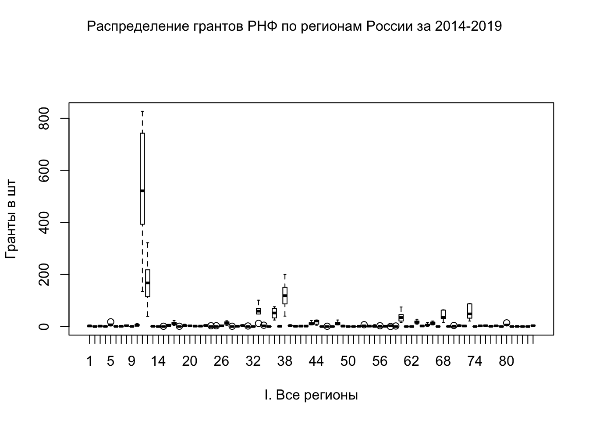
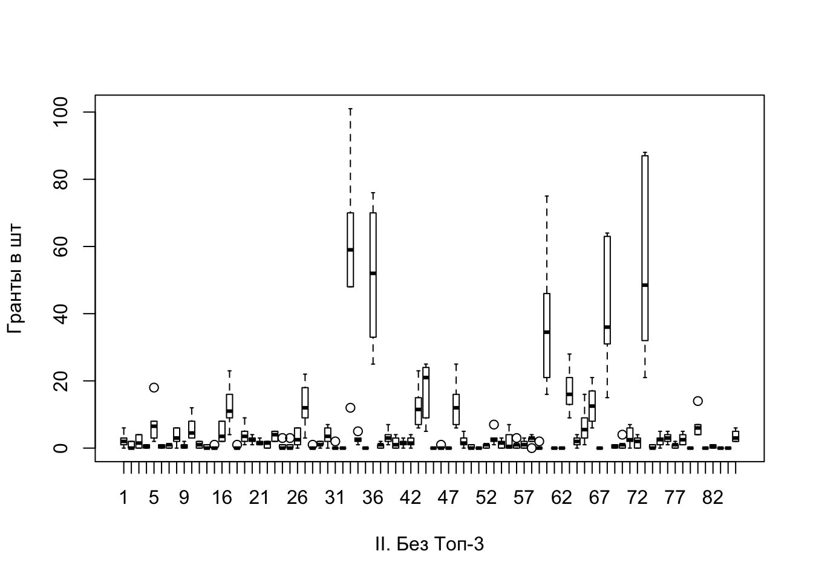
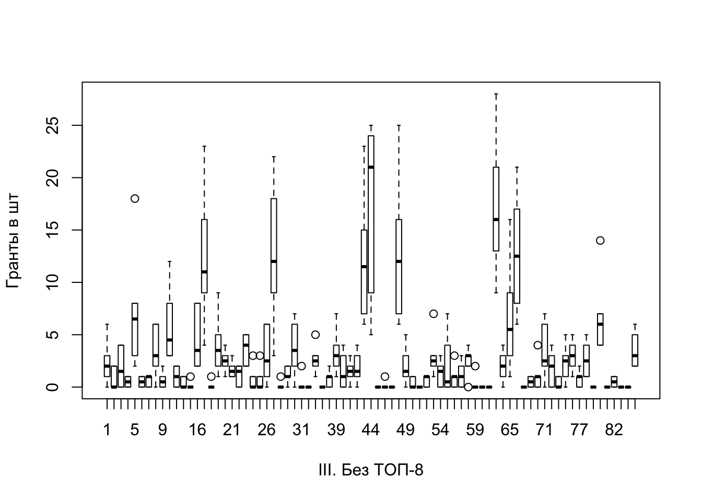
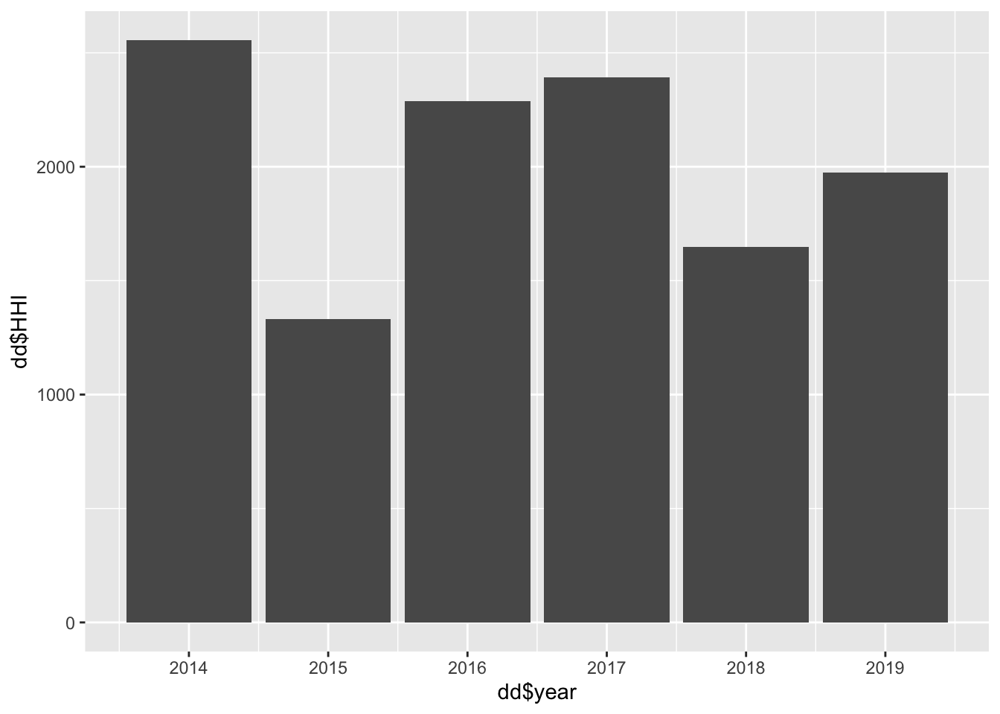
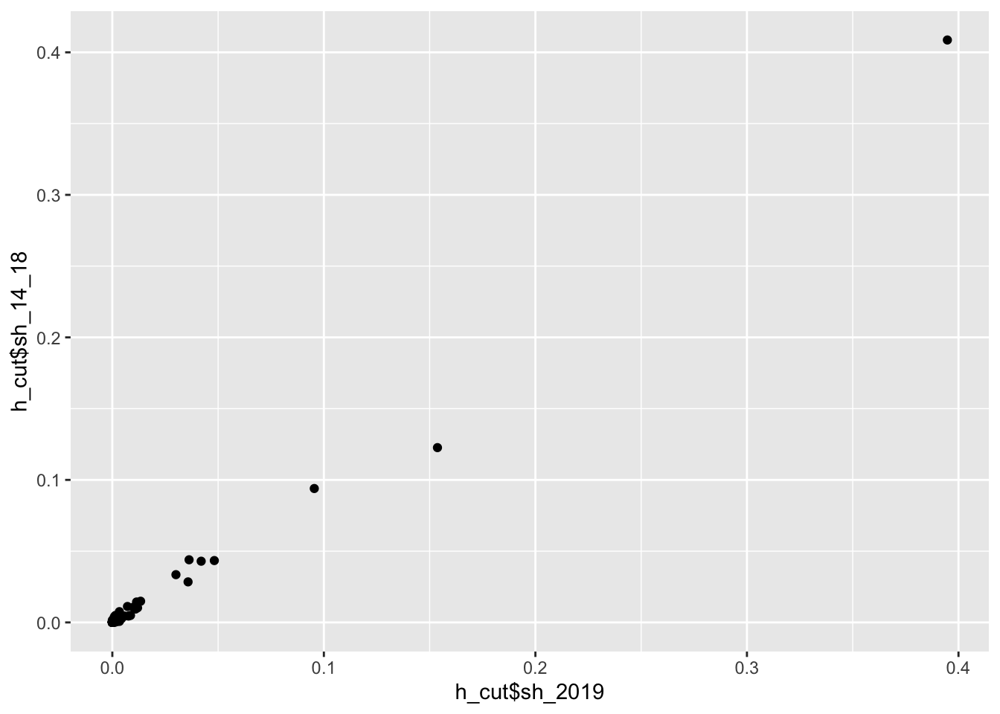
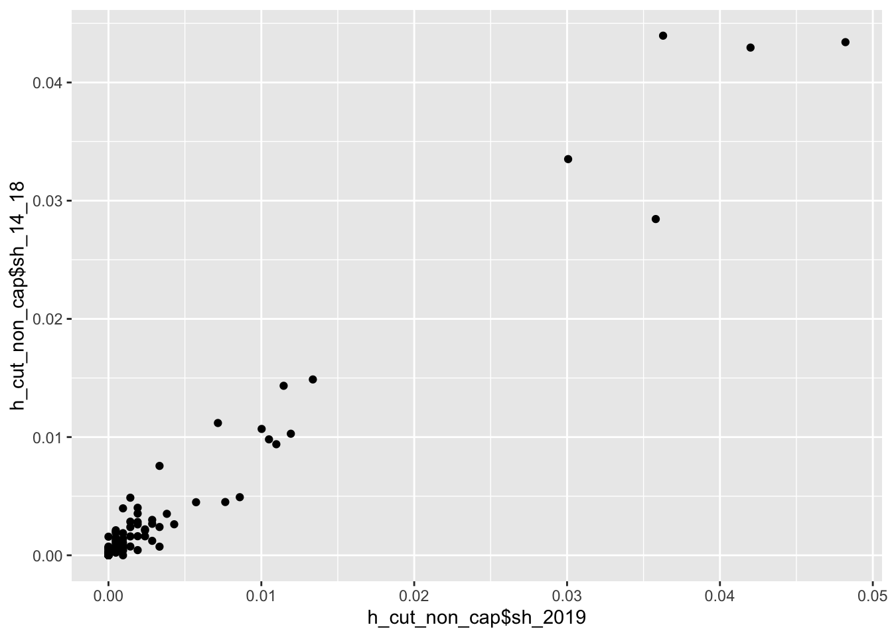
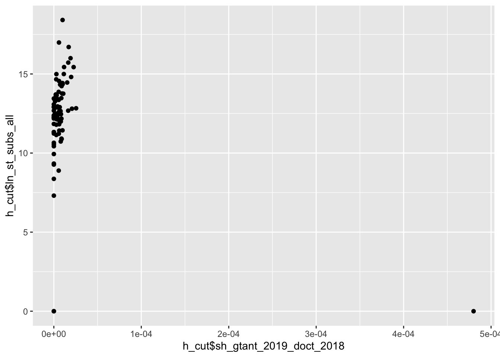
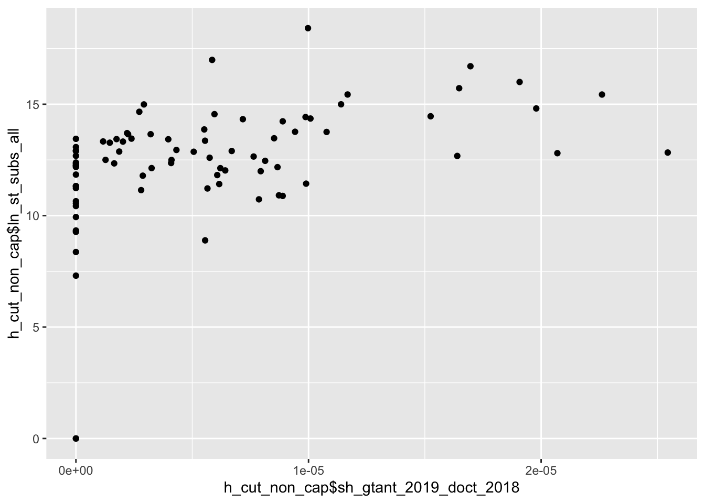
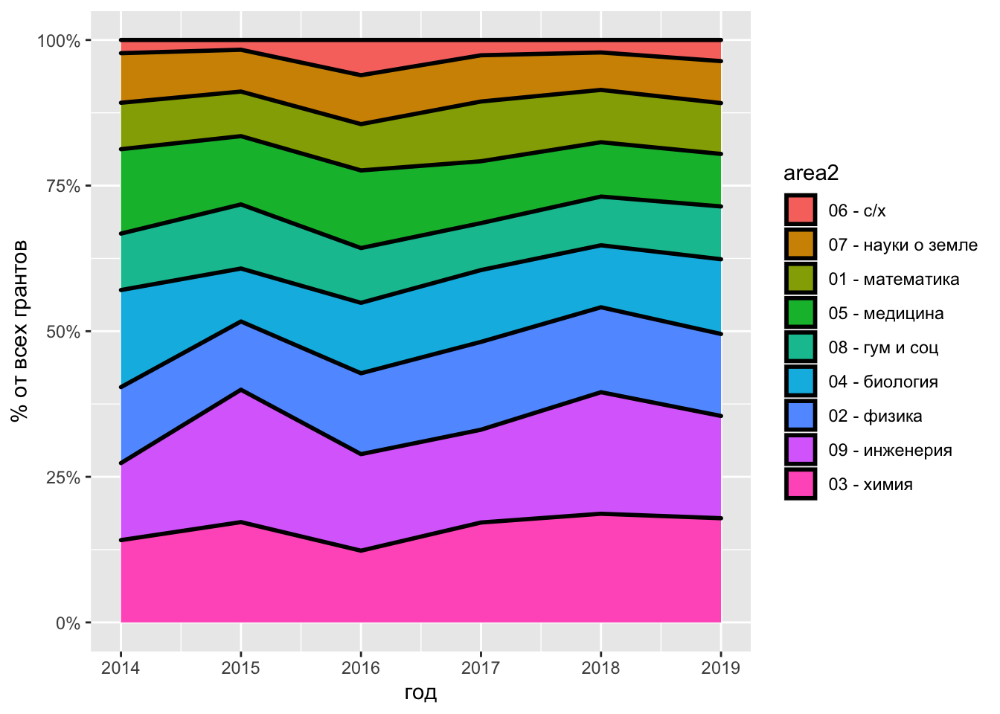

--- 
title: "Гранты РНФ"
author: ""
date: "версия от 2020-05-20"
site: bookdown::bookdown_site
output: bookdown::gitbook
documentclass: book
bibliography: [book.bib, packages.bib]
biblio-style: apalike
link-citations: yes
github-repo: rstudio/bookdown-demo
description: ""
---

# Что мы делаем

Мы знаем как распределялись гранты РНФ по регионам в 2014-2019. Мы не знаем связаны ли характеристики регинов с таким распределением. Если характеристики регионов имеют значение, то какие именно? Если характреистики регирнов не важны, то тоже интересно.


<!--chapter:end:index.Rmd-->

# Переменные и гипотезы


### Что такое _y_ {-}

1. ~~Грантов по годам на 10 000 исследователей (2014, 2015...2019)~~
2. ~~Грантов за период на 10 000 исследователей (два периода: 2014-2016, 2017-2019)~~
3. <span style="background-color: #ffe6ff">Доля грантов по годам и по двум периодам</span>

_Примечание: оставляем 3. Нормируем не исследователями, а долей, чтобы не тратить потенциальный x_. СТОП ЭТО ТАК НЕ РАБОТАЕТ. ПОДУМАЙ

### Что может обяснять _y_ {-}

Пока всё в кучу, и основные гипотези и контрольные переменные.

*** 
**H1: Деньги к деньгам** -- если регион в период _t_ тратил деньги на науку, то в период _t+1_ у него будет больше грантов РНФ.

Возможные переменные:

1. Доля ВРП на R&D (период: 2013-2018) (источник: Росстат. Регоионы России) <span style="color: #ff66cc;">есть всё</span> ✅
2. Четрыре пепеменные по финансированию из фед бюджета (период: 2015-2019) (источник: форма наука-2) <span style="color: #ff66cc;">есть 2018</span>
    + на фундаментальный исследования
    + на прикладные исследования
    + другие гранты
    + другое финансирование

_Примечание: 2 в деньгах, в логарифмах?_

*** 
**H2: Человеческие ресурсы** -- если в регионе в период _t_ большое число публикаций, то в период _t+1_ у него будет больше грантов РНФ.

Возможные переменные:

1. Доля публикаций в Scopus (период: ?) (источник: Дашин датасет, надо города раскидать по регионам) <span style="color: #ff66cc;">уточнить</span> ❗️
2. Число докторов наук (период: 2013-2018) (источник: Росстат. Регоионы России) <span style="color: #ff66cc;">есть всё</span> ✅ 
3. Число кандидатов наук (период: 2013-2018) (источник: Росстат. Регоионы России) <span style="color: #ff66cc;">есть всё</span> ✅

_Примечание: 2 и 3 нормировать на население?_

*** 
**H3: Инфрастуктура** -- если в регионе есть "особый университет" (5:100), в нем будет больше грантов РНФ.

Возможные переменные:

1. Дамми на унивеситет из 5:100 ([список тут](https://www.5top100.ru/universities/)) <span style="color: #ff66cc;">есть всё</span> ✅

_Примечание: скорее всего скореллированно с предыдущими переменными_

*** 
**H4: Гранты к грантам** -- если регион в период _t_ получил много грантов, то в период _t+1_ у него тоже будет много грантов РНФ.

Возможные переменные:

1. Доля региона в пероиод 2014-2016 (когда _у_ это доля региона в пероиод 2017-2019) <span style="color: #ff66cc;">есть</span> 

_Примечание: это что такое вообще? просто автокорреляция же? играем во веменные ряды на двух периодах? номрально ли это?_

*** 
**H5: Пространственный эффект** -- регион _i_ граничит с регионом _j_. В период _t_ регион _i_ получил много грантов, тогда в период _t+1_ регионом _j_ тоже получит много грантов. <span style="color: #ff66cc;">опровергнуто катрой</span> 

_Примечание: Для начала посмотреть карту? + [Индекс Морана](https://tsamsonov.github.io/r-geo-course/autocorrelation.html)?_

*** 
**H6: Диверсификация имеет значение** -- контроль на кол-во исследовательских организаций + чем регион преимущественно занимается. 

Возможные переменные:

1. Придумать дайверсити индекс для региона на основе данных РИНЦ (период:?) (источник: Дашин датасет) <span style="color: #ff66cc;">уточнить</span> ❗️ 

*** 
**Заметки на полях**: Откуда эксперты, кто принимает решение? Есть ли регионе человек из экспертного совета?


<!--chapter:end:02-hypothesis.Rmd-->

# Описатеьные статистики


### О данных {-}
<span style="color: #d9d9d9">_В датасете исправлены ошибки и сделаны en_названия регионов. Те full_table_7_04.csv финальный датасет со всем-всем + доп колонки с росстата. NA заменены на нули. Мое + Алексей. Надо объединить кодбук. Все преобразования датасета в файле scr1.R_</span>


### Описательные статистики {-}
<table class="table" style="font-size: 12px; margin-left: auto; margin-right: auto;">
 <thead>
  <tr>
   <th style="text-align:left;">   </th>
   <th style="text-align:right;"> nobs </th>
   <th style="text-align:right;"> NAs </th>
   <th style="text-align:right;"> Minimum </th>
   <th style="text-align:right;"> Maximum </th>
   <th style="text-align:right;"> X1..Quartile </th>
   <th style="text-align:right;"> X3..Quartile </th>
   <th style="text-align:right;"> Mean </th>
   <th style="text-align:right;"> Median </th>
   <th style="text-align:right;"> Sum </th>
  </tr>
 </thead>
<tbody>
  <tr>
   <td style="text-align:left;"> rnf2014 </td>
   <td style="text-align:right;"> 85 </td>
   <td style="text-align:right;"> 34 </td>
   <td style="text-align:right;"> 1 </td>
   <td style="text-align:right;"> 534 </td>
   <td style="text-align:right;"> 2.00 </td>
   <td style="text-align:right;"> 8.5 </td>
   <td style="text-align:right;"> 21.96078 </td>
   <td style="text-align:right;"> 3 </td>
   <td style="text-align:right;"> 1120 </td>
  </tr>
  <tr>
   <td style="text-align:left;"> rnf2015 </td>
   <td style="text-align:right;"> 85 </td>
   <td style="text-align:right;"> 35 </td>
   <td style="text-align:right;"> 1 </td>
   <td style="text-align:right;"> 134 </td>
   <td style="text-align:right;"> 1.00 </td>
   <td style="text-align:right;"> 6.0 </td>
   <td style="text-align:right;"> 8.36000 </td>
   <td style="text-align:right;"> 3 </td>
   <td style="text-align:right;"> 418 </td>
  </tr>
  <tr>
   <td style="text-align:left;"> rnf2016 </td>
   <td style="text-align:right;"> 85 </td>
   <td style="text-align:right;"> 38 </td>
   <td style="text-align:right;"> 1 </td>
   <td style="text-align:right;"> 393 </td>
   <td style="text-align:right;"> 1.00 </td>
   <td style="text-align:right;"> 9.0 </td>
   <td style="text-align:right;"> 18.97872 </td>
   <td style="text-align:right;"> 3 </td>
   <td style="text-align:right;"> 892 </td>
  </tr>
  <tr>
   <td style="text-align:left;"> rnf2017 </td>
   <td style="text-align:right;"> 85 </td>
   <td style="text-align:right;"> 30 </td>
   <td style="text-align:right;"> 1 </td>
   <td style="text-align:right;"> 743 </td>
   <td style="text-align:right;"> 2.00 </td>
   <td style="text-align:right;"> 11.5 </td>
   <td style="text-align:right;"> 29.78182 </td>
   <td style="text-align:right;"> 4 </td>
   <td style="text-align:right;"> 1638 </td>
  </tr>
  <tr>
   <td style="text-align:left;"> rnf2018 </td>
   <td style="text-align:right;"> 85 </td>
   <td style="text-align:right;"> 21 </td>
   <td style="text-align:right;"> 1 </td>
   <td style="text-align:right;"> 509 </td>
   <td style="text-align:right;"> 1.75 </td>
   <td style="text-align:right;"> 10.0 </td>
   <td style="text-align:right;"> 22.60938 </td>
   <td style="text-align:right;"> 3 </td>
   <td style="text-align:right;"> 1447 </td>
  </tr>
  <tr>
   <td style="text-align:left;"> rnf2019 </td>
   <td style="text-align:right;"> 85 </td>
   <td style="text-align:right;"> 24 </td>
   <td style="text-align:right;"> 1 </td>
   <td style="text-align:right;"> 827 </td>
   <td style="text-align:right;"> 2.00 </td>
   <td style="text-align:right;"> 16.0 </td>
   <td style="text-align:right;"> 34.34426 </td>
   <td style="text-align:right;"> 4 </td>
   <td style="text-align:right;"> 2095 </td>
  </tr>
</tbody>
</table>

Смотрим на NA: от 21 до 38 регионов не получают грантов РНФ вообще (за 2014-2019 гг). Медиана в разы меньше среднего + третий квантиль колеблется от 6 до 16 при максимуме от 134 до 827. Рапределие далеко от нормального и будет иметь очень длинный хвост. Очень неоднородное кол-во грантов по годам: в 2015 выдали 418 грантов, в 2019 -- 2096.

### Таблицы {-}

Уйдем от штук на доли, чтобы нивелировать сильный разброс в кол-ве выданных грантов по годам. 

Попробуем поймать таблицей какую-нибудь красивую тенденцию, например, поишем регионы, которые год от года увеличивают совою долю грантов.  

###### Дурацкая таблица: _доля грантов РНФ (от всех выданных грантов РНФ по стране в соответствующй год)_ {-}


preservebd612ed08e41fb58


Столбец _sh_2014_ не окрашен, так как цвет говорит об изменении к предыдущему году. Никакой супер интересной тенденции в табличке не видно, на первый взгляд все регионы теряют доли и прирастают ими довольно хаотично. Ну кроме некоторых регионов, у которых стабильный 0. Их легко увидеть, если все столбики отсортировать по возрастанию имеющимися стрелочками.

***

$HHI=доля^2+S_{2}^{2}+...+S_{n}^{2}}$
###### Таблица получше: _доля грантов РНФ в 2014-2016 (first_period) и в 2017-2019 (second_period) (от всех выданных грантов РНФ по стране в соответствующй период)_ {-}
preservebd32a3961035e0cb

Видим стабильные ~40 % у Москвы, 11-14 % у Петербурга и 9 % у Новосибирска. Не выходя из Топ-10 уже видим у Приморья и Ростовской области по 1%, на остальные 9 страничек даже и не перелисытвать не надо.

У _first_period_ и _second_period_ коэфицент корреляции что-то около 0,85-0,9, то есть, если регион получал гранты в 2014-2016 году, то он будет получать примерно на таком же уровне в 2017-2019. И наоборот, те у кого грантов не было с самого начала, то во втором периоде чуда не случится. (РАЗБЕРИСЬ С КОЭФИЦЕНТАМИ КОРРЕЛЯЦИИ, КАКОЙ ИЗ НИХ НУЖЕН ПРИ ТАКОМ РАСПРЕДЕЛЕНИИ)

### Боксплоты {-}

Хочется посмотреть выбросы, причем поймать как будут сжиматься медиана и максимальное значаение выданных грантов, когда мы будем эти выбросы постепенно убирать.





Тут у нас уже боксплоты по панели 2014-2019. _Ось x_ -- номер региона, на первом графике сильно выбивабтся Москва(11), Санкт-Петербург(12) и Новосибирская обл(38). Например, Москва за 2014-2019 год имела максимальное кол-во грантов ~ 600 шт (по боксплоту плохо видно точное число), при этом медиана у Москвы была за эти годы примерно на уровне ~ 400 грантов. Если мы отрежем Топ-3 регона, то получим рисунок "Без Топ-3" у которого шкала _оси y_ гораздо короче, и тут у нас появлось пять новых "регинов-выбросов". Убираем их и получаем, график "Без Топ-8", где 77 регионв вполне себе уживаются в шкале до ~30 грантов. 


# Переменные из РИНЦа

Всего в РИНЦе (база Даши) есть 995 организации. Они расположены в ~~80~~ 82 регионах России из 85 (нет организаций в Ненецком АОк, Чукотском АОк  и Ямало-Ненецком АОк).

Кол-во организаций по регионам в таблице ⬇️ 
preserve85fb8322aeb9a271

***

У Даши в датасете есть **626 переменных**, я не могу разобраться 

 - какие из них лучше брать
 
 - на что лучше нормировать, чтобы регионы стали сопоставимы (люди, кол-во организаций)
 
 - среднее брать или медиану

[Датасет](https://docs.google.com/file/d/1AfGyHBd9Ech3LQTaYUL71KwSU8pBS_A-/edit?filetype=msexcel) и [кодбук](https://docs.google.com/file/d/1MlRau9SWRc3hLhG5bX_CXm3VOb0LRqwd/edit?filetype=msexcel)

## Люди из ядра РИНЦа {-}

Я выбрала один из показателей -- <span style="background-color: #ffff99">Число авторов, имеющих публикации, входящие в ядро РИНЦ, за 5 лет</span> и вот что получилось (+добавила кол-во ун-тов в регионе). 
preservea57d4277889e1eb6

## Доля классных публикаций{-}

Посчитаем <span style="background-color: #ffff99">долю (%) публикаций Scopus и Web of Science от общего числа публикаций **в организации**</span>  по такой формуле:

$$ \frac{sco\_wos\_5}{elab\_5 +1} * 100$$
где,

$sco\_wos\_5$ -	число статей в журналах, входящих в Web of Science или Scopus, за 5 лет (переменная в кодбуке -- _N_pub_WOSSC5_)

$elab\_5$ - число публикаций на elibrary, за 5 лет (переменная в кодбуке -- _N_elibrary5_)

Единицу в знаменатель мы добавили, чтобы не отрезать организации, у которых 0 публикаций на elibrary.ru за 5 лет (да, такие тоже есть, 16 из 995). Потом их можно и отрезать, пока сохраним.

<span style="background-color: #ffff99">**После этого агрегируем до уровня региона**</span>  и пока непонятно, что лучше медиана или среднее, сделаем оба варианта. Т.е. порядок действий важен! У нас такой: по каждой из 995 организаций счиатем долю классных публикаций. Потом группируем по региону и смотрим что в среднем. Сохраню столбец с кол-вом организаций в регионе, чтобы вы не пугались, что мы получили на первых местах Ленинградскую и Томскую области. Я проверила, никакой ошибки. Наши данные говорят именно об этом. Видимо надо вычищать мусор из Москвы (убирать те организации, у которых нули, либо кого-то добавлять в датасет, кого тут нет, но я не очень понимаю кого у нас нет)


preserve828feb54f74a41d2

***

## Доля классных публикаций V 2.0 {-}

<span style="background-color: #ffff99"> Уберем всех у кого за последние пять лет было < 25 публикаций в Скопус и WoS </span> . Всю остальную процедуру сохраним. У нас сразу их 995 организация осталось 525. Ленинградская область всё так же нерушима. Москва подтянулась.


preserveab33bdec3b97c5a6


## Импакт-фактор журналов {-}

У нас естьпеременная **средневзвешенный импакт-фактор журналов, в которых были опубликованы статьи** (по годам с 2010 по 2019) (переменные у Даши _y2010mean_imp_j_ и тд)


 
 
ЧТО ДЕЛАТЬ С НУЛЯМИ? ЭТО ОЧЕНЬ ВАЖНО! В данных есть три знака: -, NA, 0. Если мы считаем среднее, то: 

1) $(2 + 3 + 0)/3  = 2$ 

2) $(2 + 3 + NA)/2  = 3$ - выбран этот вариант, появились NaN = mean(NA,NA,NA)


 
 
Заменяем NaN на 0. ПОДУМАТЬ О ТОМ КАКОЕ ЕСТЬ СМЕЩЕНИЕ И КУДА

Посмотрим на три периода: 2011-2013, 2014-2016, 2017-2019.

Таблица с <span style="background-color: #ffff99"> медианными значениями _средневзвешенного импакт-фактора журналов, в которых были опубликованы статьи_ </span> по этим трем периодам. Mean, min и max просто не влезли, пришлось скрыть. 

В таблице еще больший ужас. Камчатка выпрыгнула в топы. 

preservee88a2ea585025870
 
Я проверила, ошибки нет. Такая же табличка <span style="background-color: #ffff99"> с импакт-фактрором, только со средними значениями </span> и я ради наглядности добавила еще столбик с максимумом за период 2017-2019, чтобы было понять, что просто выигрывают регионы, у которых нет стремных универов, которые своими нулями утягивают и медиану и среднее вниз.
 
preserve83b5b70bf4f8de76


## HHI {-}

$$HHI=S_1^2 + S_2^2 + ... + S_n^2$$,

где $S_1, S_2 ... S_n$  — выраженные (в процентах) доли регионов.

В случае чистой монополии, когда все гранты будут у одного региона, $HHI=10000$. 
Для двух регионов с равными долями $HHI=50^2 + 50^2 = 5000$, для 100 регионов (у нас столько нет)) с долей в 1 % $HHI=100$. Таким образом индекс Херфиндаля реагирует на  долю каждого региона от общего кол-ва грантов, выданных в стране к конкретном году.


```
##  [1] "region_rus"                       "region"                          
##  [3] "region_rus_from_map"              "region_EN_from_map"              
##  [5] "inventive_rate2018"               "research_expend_region2017"      
##  [7] "state_subsidy2018"                "state_subsidy2018_2"             
##  [9] "grant_fonds"                      "other_types_financing"           
## [11] "data_jan2019"                     "phd_students"                    
## [13] "female"                           "full_time"                       
## [15] "selffunded"                       "n_uni_phd_prog"                  
## [17] "n_uni_phd_foreign"                "n_kandidat_defence2018"          
## [19] "n_kandidat_defence_female2018"    "n_uni_diss_council"              
## [21] "n_phdsupervisors2018"             "phd_superv_professor"            
## [23] "n_phd_supervisor_female"          "n_phd_supervisor_female_prof"    
## [25] "n_uni_elibrary"                   "n_readers_elibrary"              
## [27] "n_researchers2018"                "n_unis20172018"                  
## [29] "RNF_grants"                       "n_researchers_per_grant"         
## [31] "n_uni_grants"                     "n_years_grants"                  
## [33] "n_categories_grants"              "rnf2014"                         
## [35] "rnf2015"                          "rnf2016"                         
## [37] "rnf2017"                          "rnf2018"                         
## [39] "rnf2019"                          "n_org"                           
## [41] "n_grants_1row"                    "n_grants_2row"                   
## [43] "n_grants_3row"                    "n_grants_4row"                   
## [45] "n_grants_5row"                    "n_grants_6row"                   
## [47] "n_grants_7row"                    "megagrants_all"                  
## [49] "n_people_presidentgrant"          "ECI"                             
## [51] "randd_subrank1"                   "randd_subrank2"                  
## [53] "research_outputWoS201517"         "patents_research_outputWoS201517"
## [55] "call_patents2015"                 "density_foreign_stud"            
## [57] "share_expendscience_region"       "n_projects"                      
## [59] "region_id"                        "sum_14_19"                       
## [61] "sh_2014"                          "sh_2015"                         
## [63] "sh_2016"                          "sh_2017"                         
## [65] "sh_2018"                          "sh_2019"                         
## [67] "first_period"                     "second_period"                   
## [69] "change2015"                       "change2016"                      
## [71] "change2017"                       "change2018"                      
## [73] "change2019"
```



Не забудь про ttest. Катерина правильно сказала, что это незначимая разница по годам.


 

<!--chapter:end:03-descriptives.Rmd-->

# Модели


_ПОМНИ о Чукотке и Еврейская АОб там не 0, там нет данных (примечание в росстате: засекречены WTF). Пока сделаем нули вместо NA_


###### Модель 1 {-}
Будем отталкиваться от модели вида:

$$sh\_grants_{2019} = sh\_grants_{2014-2018} +  \log(gov\_subs_{2018}) + sh\_doct_{2018}$$
где, 

$sh\_grants_{2019}$ - доля грантов у региона в 2019

$sh\_grants_{2014-2018}$ - доля грантов у региона в 2014-2018

$\log(gov\_subs_{2018})$ - логарифм суммы четырех видов субсидий из госбюджета в 2018 (см. Переменные и гипотезы Н1)

$sh\_doct_{2018}$ - доля докторов + кандидатов в регионе от общего числа по России в 2018


```
## 
## Calls:
## model: lm(formula = sh_2019 ~ sh_14_18 + ln_st_subs_all + sh_sum_DOCT_CAND_2018, 
##     data = h_cut)
## model_2: lm(formula = sh_2019 ~ ln_st_subs_all + sh_sum_DOCT_CAND_2018, 
##     data = h_cut)
## 
## =============================================
##                           model    model_2   
## ---------------------------------------------
##   (Intercept)            -0.00     -0.01     
##                          (0.00)    (0.01)    
##   sh_14_18                1.10***            
##                          (0.05)              
##   ln_st_subs_all          0.00      0.00     
##                          (0.00)    (0.00)    
##   sh_sum_DOCT_CAND_2018  -0.12*     1.02***  
##                          (0.05)    (0.03)    
## ---------------------------------------------
##   R-squared               0.99      0.95     
##   N                      85        85        
## =============================================
##   Significance: *** = p < 0.001;   
##                 ** = p < 0.01; * = p < 0.05
```


#### Диаграммы рассеяния {-}

_Доля грантов у региона в 2019_ и _доля грантов у региона в 2014-2018_ связаны линейно.


Уберем ТОП-3 всё еще связаны линейно. 


Точно такие же графики по связи _доли грантов у региона в 2019_ и _доли докторов + кандидатов в регионе от общего числа по России в 2018_

###### Модель 2 {-}

ПОМНИ ЧТО ДОКТОРА +1, ЧТОБЫ ЗНАМЕНАТЕЛЬ БЫЛ НЕ НУЛЕВОЙ


Нормируем на численность докторов + кандидатов регионе.

$$sh\_grants_{2019}/doct_{2018} = sh\_grants_{2014-2018} +  \log(gov\_subs_{2018})$$

$$grants_{2019}/doct_{2018} = sh\_grants_{2014-2018} +  \log(gov\_subs_{2018}) $$

где, 

$sh\_grants_{2019}$ - доля грантов у региона в 2019

$sh\_grants_{2014-2018}$ - доля грантов у региона в 2014-2018

$\log(gov\_subs_{2018})$ - логарифм суммы четырех видов субсидий из госбюджета в 2018 (см. Переменные и гипотезы Н1)

$sh\_doct_{2018}$ - доля докторов + кандидатов в регионе от общего числа по России в 2018 (нет 2019, поэтому посмотрим пока 2018)


```
## 
## Calls:
## model_3: lm(formula = sh_gtant_2019_doct_2018 ~ sh_14_18 + ln_st_subs_all, 
##     data = h_cut)
## model_4: lm(formula = gtant_2019_doct_2018 ~ sh_14_18 + ln_st_subs_all, 
##     data = h_cut)
## 
## =================================================================
##                           model_3                model_4         
##                  ------------------------ ---------------------   
##                   sh_gtant_2019_doct_2018  gtant_2019_doct_2018  
## -----------------------------------------------------------------
##   (Intercept)             0.00***                 0.22***        
##                          (0.00)                  (0.05)          
##   sh_14_18                0.00                    0.39           
##                          (0.00)                  (0.24)          
##   ln_st_subs_all         -0.00***                -0.02***        
##                          (0.00)                  (0.00)          
## -----------------------------------------------------------------
##   R-squared               0.19                    0.19           
##   N                      85                      85              
## =================================================================
##   Significance: *** = p < 0.001; ** = p < 0.01; * = p < 0.05
```

#### Диаграммы рассеяния для моделей 2 {-}

_Доля грантов у региона в 2019_ и _доля грантов у региона в 2014-2018_ связаны линейно.


Ошибка с "Еврейская АОб", она выкинута 



                         


<!--chapter:end:05-models.Rmd-->

# Университеты и их гранты


Соединим Дашин датасет по РИНЦу и данные Алексея по грантам универов.


У нас **7610 грантов** за 2014-2019 годы. 

В РИНЦе нет 23 организации, которые получали гранты РНФ (всего 33 гратнта из 7610 мы далее выбросим из анализа). 

Что мы хотимс посмотреть:

1. Топ организаций по грантам

2. Топ регионов по грантам с информацией о кол-ве организваций

3. Топ универов по Доле классных публикаций 

4. Топ регионов по доле классных публикаций

5. ~~3 и 4 (для организаций > 25 Скопусовских/WoS за 5 лет)~~

***

##### Таблица 1: Топ организаций по грантам  {-}

preservef7bcd01a2ae4e0db

***

##### Таблица 2: Топ регионов по грантам с информацией о кол-ве организваций  {-}

preserve7ba368d604a80f27

***

##### Таблица 3: Топ универов по Доле классных публикаций  {-}

Посчитаем <span style="background-color: #ffff99">долю (%) публикаций Scopus и Web of Science от общего числа публикаций **в организации**</span>  по такой формуле:

$$ \frac{sco\_wos\_5}{elab\_5 +1} * 100$$
где,

$sco\_wos\_5$ -	число статей в журналах, входящих в Web of Science или Scopus, за 5 лет (переменная в кодбуке -- _N_pub_WOSSC5_)

$elab\_5$ - число публикаций на elibrary, за 5 лет (переменная в кодбуке -- _N_elibrary5_)

Единицу в знаменатель мы добавили, чтобы не отрезать организации, у которых 0 публикаций на elibrary.ru за 5 лет.


preserve413b5dd7871f4462

***

Теперь агрегируем эти данные по универам, чтобы получить данные по регионам. 

КАК МЫ АГРЕГИРУЕМ: агрегируем по грантам, а не по организациям. Например, в Воронежской области на 4 организации приходится 35 грантов. Причем одна организация с самым высоким показателем класнных публикаций получила большую часть из этих 35 грантов. Таким образом,  самое большое значение (максимум) еще и встало на место медианы. 


##### Таблица 4: Топ регионов по доле классных публикаций  {-}

Тут мы делаем рейтинг регионов ТОЛЬКО по организациям, которые хоть раз получали грант РНФ. 

preserve3c04fb056ba0f339


# Идеи от Михаила {-}


1. Посмотреть как часто повторяются фамилии

2. Кол-во гос организаций (РАН, гос вузы) vs. негосударственные (автономные): гранты как мертоновская "награда", эффект Матфея

3. По областям фиксируют квоты?

4. Динамика после 5:100


### 1. Как часто повторяются фамилии {-}

В таблице 5 пока первое приближение. Надо контролировать на "Конкурс на продление сроков" и тезок. Первое сделать проще, второе - сложнее. Например, Иванов Д. В. это скорее всего три разных человека судя по аффилиации и области знания. 

##### Таблица 5. Число гранов у руководителей {-}
preservebf0b1a8e21d561c4

Оставим группировку по ФИО, но посмотрим какие научные области прячутся внутри. Добавим к таблице 5 колонку с этой инфомацией.

##### Таблица 6. {-}
preserve0cccd5c4df3e6cc7

Предположительно мы сразу видем тезок в первой десятке, разобъем их.

##### Таблица 7. {-}
preservecfb0baa73d1100d8

Иванов К. Л. видимо всё еще два человека, которые оба получили гранты в области 03 - Химия. Если нужно, то можно еще более детально разбить - с учетом аффилиации руководителя проекта. 

Но для начала  проконтролируем на "Конкурс на продление сроков", чтобы понять кто получил несколько независимых друг от друга грантов. В выборке есть 902 гранта по "Конкурсу на продление сроков". Уберем их и у нас останется:

##### Таблица 8. {-}
preserve1bf7794ee2e919e8

Таким образом, мы убрали все "продления" грантов, попытались раскидать тезок через области знания, и получили следующую картину:

##### Таблица 9a. {-}
<table class="table table-striped" style="width: auto !important; margin-left: auto; margin-right: auto;">
 <thead>
  <tr>
   <th style="text-align:right;"> Число грантов (без продлений) </th>
   <th style="text-align:right;"> Руклводителей грантов </th>
  </tr>
 </thead>
<tbody>
  <tr>
   <td style="text-align:right;"> 1 </td>
   <td style="text-align:right;"> 5275 </td>
  </tr>
  <tr>
   <td style="text-align:right;"> 2 </td>
   <td style="text-align:right;"> 714 </td>
  </tr>
  <tr>
   <td style="text-align:right;"> 3 </td>
   <td style="text-align:right;"> 1 </td>
  </tr>
  <tr>
   <td style="text-align:right;"> 4 </td>
   <td style="text-align:right;"> 1 </td>
  </tr>
</tbody>
</table>

У нас 714  руководителей получали грант дважды (это ~ 12 %). Кончечно там тоже могут прятаться тезки, которые кроме одинаковых ФИО еще имеют одинаковые научные области. Уникумы у нас видимо только Ремесленников В. Н. и один из Ивановых К. Л., которые получали гранты трижды (и это не считая продлений).

<span style="background-color: #ff99dd"> Катерина предложила посмотреть чем занисаются авторы, которые плучают два гранта (из каких они областей). Уберем двоих авторов-уникумов, у которых > 2 грантов.</span>

##### Таблица 9b. {-}
<table class="table table-striped" style="width: auto !important; margin-left: auto; margin-right: auto;">
 <thead>
<tr>
<th style="border-bottom:hidden" colspan="1"></th>
<th style="border-bottom:hidden; padding-bottom:0; padding-left:3px;padding-right:3px;text-align: center; " colspan="2"><div style="border-bottom: 1px solid #ddd; padding-bottom: 5px; ">Авторов, получивших</div></th>
<th style="border-bottom:hidden; padding-bottom:0; padding-left:3px;padding-right:3px;text-align: center; " colspan="2"><div style="border-bottom: 1px solid #ddd; padding-bottom: 5px; ">Авторов, получивших</div></th>
</tr>
  <tr>
   <th style="text-align:left;"> area </th>
   <th style="text-align:right;"> 1 грант (чел) </th>
   <th style="text-align:right;"> 2 гранта (чел) </th>
   <th style="text-align:right;"> 1 грант (%) </th>
   <th style="text-align:right;"> 2 гранта (%) </th>
  </tr>
 </thead>
<tbody>
  <tr>
   <td style="text-align:left;"> 01 - математика </td>
   <td style="text-align:right;"> 468 </td>
   <td style="text-align:right;"> 54 </td>
   <td style="text-align:right;"> 89.7 </td>
   <td style="text-align:right;"> 10.35 </td>
  </tr>
  <tr>
   <td style="text-align:left;"> 02 - физика </td>
   <td style="text-align:right;"> 755 </td>
   <td style="text-align:right;"> 97 </td>
   <td style="text-align:right;"> 88.6 </td>
   <td style="text-align:right;"> 11.38 </td>
  </tr>
  <tr>
   <td style="text-align:left;"> 03 - химия </td>
   <td style="text-align:right;"> 853 </td>
   <td style="text-align:right;"> 133 </td>
   <td style="text-align:right;"> 86.5 </td>
   <td style="text-align:right;"> 13.49 </td>
  </tr>
  <tr>
   <td style="text-align:left;"> 04 - биология </td>
   <td style="text-align:right;"> 594 </td>
   <td style="text-align:right;"> 127 </td>
   <td style="text-align:right;"> 82.4 </td>
   <td style="text-align:right;"> 17.61 </td>
  </tr>
  <tr>
   <td style="text-align:left;"> 05 - медицина </td>
   <td style="text-align:right;"> 531 </td>
   <td style="text-align:right;"> 90 </td>
   <td style="text-align:right;"> 85.5 </td>
   <td style="text-align:right;"> 14.49 </td>
  </tr>
  <tr>
   <td style="text-align:left;"> 06 - с/х </td>
   <td style="text-align:right;"> 173 </td>
   <td style="text-align:right;"> 10 </td>
   <td style="text-align:right;"> 94.5 </td>
   <td style="text-align:right;"> 5.46 </td>
  </tr>
  <tr>
   <td style="text-align:left;"> 07 - науки о земле </td>
   <td style="text-align:right;"> 397 </td>
   <td style="text-align:right;"> 52 </td>
   <td style="text-align:right;"> 88.4 </td>
   <td style="text-align:right;"> 11.58 </td>
  </tr>
  <tr>
   <td style="text-align:left;"> 08 - гум и соц </td>
   <td style="text-align:right;"> 526 </td>
   <td style="text-align:right;"> 46 </td>
   <td style="text-align:right;"> 92.0 </td>
   <td style="text-align:right;"> 8.04 </td>
  </tr>
  <tr>
   <td style="text-align:left;"> 09 - инженерия </td>
   <td style="text-align:right;"> 962 </td>
   <td style="text-align:right;"> 105 </td>
   <td style="text-align:right;"> 90.2 </td>
   <td style="text-align:right;"> 9.84 </td>
  </tr>
</tbody>
</table>

<span style="background-color: #ff99dd"> Среди биологов ~ 18 % руководителей проектов получили два гранта (без учета продлений). В с/х науках только 5 % авторов получили два гранта. </span>


### 2. Гос организаций  vs. негос {-}

Вернулись к выборке из 7577 грантов (у которых нашлась организация в РИНЦе). Сделаем дамми для гос организаций (помимо всяких федеральных бла-бла, бюджетных бла-бла, мы туда добавили акционерные общества при гос учреждениях, например, Акционерное общество Государственный оптический институт или Акционерное общество Государственный научно-исследовательский и проектный институт редкометаллической промышленности). Вот что получилось (не забудь поправить NA -- засунуть в гос организации, это ИНСТИТУТ МОНГОЛОВЕДЕНИЯ, БУДДОЛОГИИ И ТИБЕТОЛОГИИ СО РАН Улан-Удэ). 

##### Таблица 10. {-}
<table class="table table-striped" style="width: auto !important; margin-left: auto; margin-right: auto;">
 <thead>
  <tr>
   <th style="text-align:right;"> gov </th>
   <th style="text-align:right;"> n </th>
  </tr>
 </thead>
<tbody>
  <tr>
   <td style="text-align:right;"> 0 </td>
   <td style="text-align:right;"> 162 </td>
  </tr>
  <tr>
   <td style="text-align:right;"> 1 </td>
   <td style="text-align:right;"> 7413 </td>
  </tr>
  <tr>
   <td style="text-align:right;"> NA </td>
   <td style="text-align:right;"> 2 </td>
  </tr>
</tbody>
</table>

Из всех 7577 грантов, только 162 (~2 %) ушло негосударственным организациям. Посмотрим кто у нас получил эти 162 гранта и что за негосударственные организации там прячутся.

##### Таблица 11 a. {-}
preservee7b85a329ccb49c8

Всего 162 гратна распределились между 27 негосударственнми организациями. Возможно я тут зря кого-то из них не отнесла к государтвеннми, но если что, поправлю.
Я если честно не знаю какой вывод тут деалть, много это или мало, что только 2 % грантов уходит негосударственным организациям. Если бы у нас тут были только вузы, мы бы посмотрели генеральную совокупность всех вузов в России, обнаружили, что из, допустим, 1500 вузов россии 90 % - государственные + их филиалы, а 10 % негосудартственные. Тогда бы мы сказали, смотрите, негосударственных вузов 10 %, а грантов они получают только 2%. Но мы так не можем сделать, так как львиная доля всех грантов у нас уходит во всевозможные подразделения РАН. 


<span style="background-color: #ff99dd"> Попробуем оставить только вузы. Возьмем мониторинг вузов: 822 вуза, частные + гос, без филиалов (файл от Анжелики).</span>

<table class="table table-striped" style="width: auto !important; margin-left: auto; margin-right: auto;">
 <thead>
  <tr>
   <th style="text-align:right;"> private </th>
   <th style="text-align:right;"> n </th>
  </tr>
 </thead>
<tbody>
  <tr>
   <td style="text-align:right;"> 0 </td>
   <td style="text-align:right;"> 502 </td>
  </tr>
  <tr>
   <td style="text-align:right;"> 1 </td>
   <td style="text-align:right;"> 320 </td>
  </tr>
</tbody>
</table>

<span style="background-color: #ff99dd"> Пропорция странная, неужели в России из 822 вузов 320 - частные (39 %). Смэтчим этот датасет из мониторинга с нашими грантами. Т.е. у нас у каждого гранта (~ 7600 шт) стоит организация посмотрим какие из них есть в мониторинге, они и будут нашими вузами (гос + негос). Всё что не найдется в мониторине мы будем считать НЕ ВУЗАМИ. Туда попадут всё акционерные обзества, подразделения РАН, научные центры, и к сожалению филиалы вузов (если такие вообще были, я не уверена). После этих действий мы получаем Таблицу_11_б: </span>

##### Таблица 11 б. {-}

<table class="table table-striped" style="width: auto !important; margin-left: auto; margin-right: auto;">
 <thead>
  <tr>
   <th style="text-align:left;"> тип организации </th>
   <th style="text-align:right;"> кол-во грантов </th>
   <th style="text-align:right;"> % </th>
  </tr>
 </thead>
<tbody>
  <tr>
   <td style="text-align:left;"> государственный вуз </td>
   <td style="text-align:right;"> 3244 </td>
   <td style="text-align:right;"> 43 </td>
  </tr>
  <tr>
   <td style="text-align:left;"> частный вуз </td>
   <td style="text-align:right;"> 72 </td>
   <td style="text-align:right;"> 1 </td>
  </tr>
  <tr>
   <td style="text-align:left;"> не вуз </td>
   <td style="text-align:right;"> 4261 </td>
   <td style="text-align:right;"> 56 </td>
  </tr>
</tbody>
</table>

<span style="background-color: #ff99dd">  Вузы за 2014-2019 получили 44 % грантов РНФ. Причем частные вузы получили только 1 % всех грантов. Составим рейтинги организаций этих трех типов. </span>

У нас Иннополлис и Институт программных систем попали не туда, поправим их.


##### Таблица 11 в. Гос вузы и их гранты{-}
preserve57c1dba06628610d

<span style="background-color: #ff99dd">
192 гос универа получили 3244 гранта (43 % от всех грантов РНФ).</span>


##### Таблица 11 г. Частные вузы и их гранты{-}
preservea9f26293220b69b3

<span style="background-color: #ff99dd">
11 частных универа получили 72 гранта (1 % от всех грантов РНФ).</span>

##### Таблица 11 д. НЕ ВУЗЫ и их гранты{-}
preserve73147aa8a3d5acd8

<span style="background-color: #ff99dd"> 
404 НЕ вуза получили 4261 гранта (56 % от всех грантов РНФ).</span>

<span style="background-color: #ff99dd"> 
Вернемся к обнареженной странноти: у нас в мониторинге вузов (по сути это наша генеральная совокупность ) часных вузов - 39 %. Давайте посмортрим какой процент часных вузов среди нашиз вузов-грантополучателей. </span>

<table class="table table-striped" style="width: auto !important; margin-left: auto; margin-right: auto;">
 <thead>
  <tr>
   <th style="text-align:right;"> private </th>
   <th style="text-align:right;"> вузы (шт) </th>
   <th style="text-align:right;"> % </th>
  </tr>
 </thead>
<tbody>
  <tr>
   <td style="text-align:right;"> 0 </td>
   <td style="text-align:right;"> 192 </td>
   <td style="text-align:right;"> 95 </td>
  </tr>
  <tr>
   <td style="text-align:right;"> 1 </td>
   <td style="text-align:right;"> 11 </td>
   <td style="text-align:right;"> 5 </td>
  </tr>
</tbody>
</table>

<span style="background-color: #ff99dd">
**Получили только 5 %. То есть у нас следующая странность. Из всех вузов, существующих в России, у нас 39 % - частные. Из всех вузов, которые хоть раз получали грант РНФ, у нас 5 % - частные.** 
</span>

### 3. По областям фиксируют квоты? {-}

У нас есть 14 грантов у которых нет кода области, уберем их. Остается 7596 гратнов за 2014-2019 гг. Посмотрим по годам и областям знания:

##### Таблица 12. {-}
<table class="table table-striped" style="width: auto !important; margin-left: auto; margin-right: auto;">
 <thead>
  <tr>
   <th style="text-align:left;"> area </th>
   <th style="text-align:right;"> 2014 </th>
   <th style="text-align:right;"> 2015 </th>
   <th style="text-align:right;"> 2016 </th>
   <th style="text-align:right;"> 2017 </th>
   <th style="text-align:right;"> 2018 </th>
   <th style="text-align:right;"> 2019 </th>
  </tr>
 </thead>
<tbody>
  <tr>
   <td style="text-align:left;"> 01 </td>
   <td style="text-align:right;"> 88 </td>
   <td style="text-align:right;"> 32 </td>
   <td style="text-align:right;"> 71 </td>
   <td style="text-align:right;"> 168 </td>
   <td style="text-align:right;"> 130 </td>
   <td style="text-align:right;"> 183 </td>
  </tr>
  <tr>
   <td style="text-align:left;"> 02 </td>
   <td style="text-align:right;"> 144 </td>
   <td style="text-align:right;"> 49 </td>
   <td style="text-align:right;"> 124 </td>
   <td style="text-align:right;"> 247 </td>
   <td style="text-align:right;"> 211 </td>
   <td style="text-align:right;"> 295 </td>
  </tr>
  <tr>
   <td style="text-align:left;"> 03 </td>
   <td style="text-align:right;"> 156 </td>
   <td style="text-align:right;"> 72 </td>
   <td style="text-align:right;"> 110 </td>
   <td style="text-align:right;"> 281 </td>
   <td style="text-align:right;"> 270 </td>
   <td style="text-align:right;"> 375 </td>
  </tr>
  <tr>
   <td style="text-align:left;"> 04 </td>
   <td style="text-align:right;"> 184 </td>
   <td style="text-align:right;"> 38 </td>
   <td style="text-align:right;"> 108 </td>
   <td style="text-align:right;"> 202 </td>
   <td style="text-align:right;"> 154 </td>
   <td style="text-align:right;"> 269 </td>
  </tr>
  <tr>
   <td style="text-align:left;"> 05 </td>
   <td style="text-align:right;"> 160 </td>
   <td style="text-align:right;"> 49 </td>
   <td style="text-align:right;"> 119 </td>
   <td style="text-align:right;"> 174 </td>
   <td style="text-align:right;"> 135 </td>
   <td style="text-align:right;"> 189 </td>
  </tr>
  <tr>
   <td style="text-align:left;"> 06 </td>
   <td style="text-align:right;"> 25 </td>
   <td style="text-align:right;"> 7 </td>
   <td style="text-align:right;"> 54 </td>
   <td style="text-align:right;"> 43 </td>
   <td style="text-align:right;"> 31 </td>
   <td style="text-align:right;"> 76 </td>
  </tr>
  <tr>
   <td style="text-align:left;"> 07 </td>
   <td style="text-align:right;"> 94 </td>
   <td style="text-align:right;"> 30 </td>
   <td style="text-align:right;"> 75 </td>
   <td style="text-align:right;"> 130 </td>
   <td style="text-align:right;"> 93 </td>
   <td style="text-align:right;"> 151 </td>
  </tr>
  <tr>
   <td style="text-align:left;"> 08 </td>
   <td style="text-align:right;"> 107 </td>
   <td style="text-align:right;"> 46 </td>
   <td style="text-align:right;"> 84 </td>
   <td style="text-align:right;"> 132 </td>
   <td style="text-align:right;"> 121 </td>
   <td style="text-align:right;"> 190 </td>
  </tr>
  <tr>
   <td style="text-align:left;"> 09 </td>
   <td style="text-align:right;"> 146 </td>
   <td style="text-align:right;"> 95 </td>
   <td style="text-align:right;"> 148 </td>
   <td style="text-align:right;"> 261 </td>
   <td style="text-align:right;"> 302 </td>
   <td style="text-align:right;"> 368 </td>
  </tr>
</tbody>
</table>

Это были гранты в штуках. Ничего непонятно. Пересчитаем в долях от общего числа выданных грантов в соответствующем году.


##### Таблица 13. {-}
preserve31763d147de9d949

Т.е. в 2014 году по направлениб 01 - Математика дали 8 %  от всех выданных за тот год грантов. Визуализируем эту табличку.


##### График 1. {-}


Слои дают примерное представление о пропорции, но динамика видна не очень, посмотрим на аномальные скачки (если такие имеются) на другом типе графиков.

##### График 2. {-}


Надо подумать что мы видим, но самое главное не забывать проверять на заначимость.


 

<!--chapter:end:06-universities.Rmd-->

